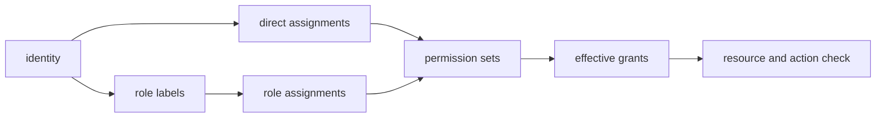

Attune separates authentication from authorization. Authentication establishes a principal and token type. Authorization expands that principal's permission sets into grants, then checks a resource, action, and context. Protected Axum routes use `RequireAuth`, but each route still needs the relevant authorization check.

See [Authentication and identity](/administration/authentication-and-identity/) and [Permissions and RBAC](/administration/permissions-and-rbac/) for administration.

## PostgreSQL representation

The [identity and auth migration](https://github.com/attune-system/attune/blob/main/migrations/20250101000003_identity_and_auth.sql) defines the persisted relationships.

| Table | Purpose |
| --- | --- |
| `identity` | Unique login, display name, optional Argon2 password hash, provider attributes, frozen state |
| `permission_set` | Pack-owned or system permission bundle with JSONB `grants` |
| `permission_assignment` | Direct many-to-many identity to permission-set link |
| `identity_role_assignment` | Manual or externally managed role label for an identity |
| `permission_set_role_assignment` | Role label to permission-set link |
| `integration_token` | Revocable passwordless credential metadata and token hash |

An identity can represent a person or service account. Local identities have `password_hash`. OIDC and LDAP identities store provider details under `attributes` and can have no local password. OIDC has a partial unique index on issuer and subject. `frozen` blocks authentication for that identity.

Permission-set refs use `pack.name` form. `grants` is a JSON array parsed into the canonical `Grant` type. A grant names one `resource`, a list of `actions`, and optional constraints. Resources include packs, actions, queues, queue items, executions, keys, caches, artifacts, identities, permissions, and other API concepts. Actions include `read`, `create`, `update`, `delete`, `execute`, `manage`, and `decrypt` where meaningful.

Constraints are conjunctive within one grant. Available fields include pack refs, owner rules, owner types and refs, visibility, execution scope, target refs and IDs, encrypted status, and exact identity attributes. Multiple matching grants are additive because authorization succeeds when any grant allows the requested resource and action. There is no explicit deny grant. The source type and evaluator are in [`rbac.rs`](https://github.com/attune-system/attune/blob/main/crates/common/src/rbac.rs).

## Effective grants

For a user access token, `AuthorizationService` loads directly assigned permission sets and role-derived permission sets, deduplicates them, parses their grants, and evaluates the request context. Identity attributes can satisfy attribute constraints. Short-lived metadata caches reduce repeated reads; permission and identity change messages invalidate those caches. The implementation and its five-second cache default are in [`authz.rs`](https://github.com/attune-system/attune/blob/main/crates/api/src/authz.rs#L40-L199).

List endpoints often compile grants into repository SQL so inaccessible rows never enter pagination or totals. Resource-specific rules still matter. For example, artifact execution linkage can override owner visibility, and identity-owned keys require explicit constrained access from another identity. The generic evaluator alone does not encode every row-visibility rule.

Identity and permission administration routes themselves require `identities` or `permissions` grants. Deleting a permission set cascades its direct and role assignments. Deleting an identity cascades assignments and integration tokens, but identity-owned cache namespaces can delay deletion until retention cleanup finishes.

## Token types

User access and refresh tokens are signed JWTs, not database session rows. Access tokens carry the identity subject and use current assignments when the API resolves effective grants. Refresh tokens mint new access credentials according to the authentication flow.

Integration tokens are long-lived login credentials attached to one identity. Attune returns plaintext only at creation. PostgreSQL stores a deterministic SHA-256 hash plus safe display prefix and suffix, expiry, last-use metadata, and revocation fields. Token login hashes the supplied secret, rejects expired or revoked records and frozen identities, then issues access and integration refresh JWTs. Deleting an identity cascades its integration tokens. See the [integration token repository](https://github.com/attune-system/attune/blob/main/crates/common/src/repositories/integration_token.rs) and [token login route](https://github.com/attune-system/attune/blob/main/crates/api/src/routes/auth.rs#L547-L600).

Execution tokens are different again. The worker mints a short-lived JWT for one execution only when its permission-set snapshot is non-empty. The token embeds `execution_id`, action ref, and `permission_set_refs`. Authorization loads only those named sets, never the initiating identity's full current roles. This makes execution access explicit and reviewable at the action, rule, workflow task, or work queue that supplied the snapshot.

The reserved ref `standard` is handled in code rather than loaded as an ordinary permission-set row. It grants scoped key read and decrypt, artifact operations, and read-only cache access for the executing action and pack. Workflow child tokens can also include the containing workflow action and pack. Named permission sets add further grants. The JWT metadata is created in the [common JWT code](https://github.com/attune-system/attune/blob/main/crates/common/src/auth/jwt.rs#L450-L522), and the API expands standard access in [AuthorizationService](https://github.com/attune-system/attune/blob/main/crates/api/src/authz.rs#L649-L773).

Sensor and worker tokens use dedicated signed scope checks. `AuthorizationService` does not treat them as user identities with effective permission assignments. Cache routes, for example, validate sensor cache authority separately.

## Lifecycle and caveats

- Freezing an identity blocks new authentication. Contributors must check the exact token-validation path before assuming it revokes every already-issued JWT immediately.
- Changing direct or role assignments changes later access-token authorization because grants are resolved server-side, subject to the short authorization cache and invalidation delivery.
- An execution token references permission-set refs by name. If a named set disappears, authorization fails rather than falling back to the executor identity.
- Integration-token hashes are credential verifiers. They are not encrypted copies of token plaintext, and the original token cannot be recovered from the database.
- Delegation checks prevent callers from attaching permission sets to child execution contexts when those sets grant actions beyond the caller's own access.
