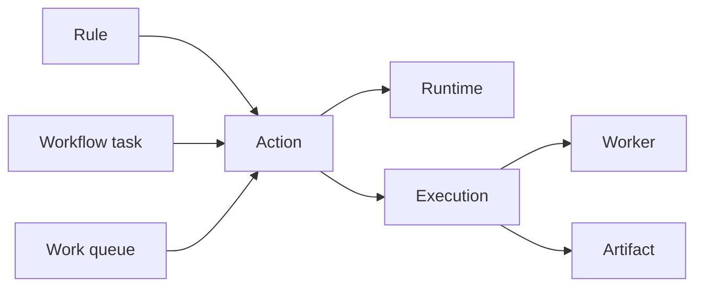

An action is the persisted contract for one executable unit. It tells the worker what entrypoint to run, which runtime can run it, how inputs and output are encoded, and which scheduling or retention defaults apply. Rules, workflows, queues, and direct API requests all converge on an action before Attune creates an execution.

## PostgreSQL representation

The `action` table belongs to a pack through a required `pack` foreign key with `ON DELETE CASCADE`. Both `ref` and `pack_ref` are stored. `ref` is globally unique, lowercase, and has the `<pack>.<name>` shape.

| Concern | Meaningful columns |
| --- | --- |
| Code | `entrypoint`, `runtime`, `runtime_version_constraint` |
| Interface | `param_schema`, `out_schema`, `parameter_delivery`, `parameter_format`, `output_format` |
| Scheduling | `required_worker_runtimes`, `worker_selector`, `worker_tolerations`, `worker_affinity`, `timeout_seconds` |
| Access | `accesses_mcp`, `default_execution_permission_set_refs`, `reference_visibility`, `reference_allowed_pack_refs` |
| Classification | `enabled`, `is_adhoc`, `workflow_def` |
| Retention | `log_retention_policy`, `log_retention_limit`, `artifact_retention_policy`, `artifact_retention_limit` |

`param_schema` and `out_schema` use Attune's flat per-field format, not raw JSON Schema. The API converts a flat parameter schema to JSON Schema internally when it validates values. Fields such as `required`, `secret`, and `position` are Attune extensions attached to each named field.

Action parameters are a flat object. `execution.config` stores that object directly and never wraps it as `{"parameters": {...}}`. The standard action contract delivers parameters as stdin JSON, not environment variables. The database can represent stdin or temporary-file delivery and JSON, YAML, or dotenv serialization, but new action definitions use stdin JSON unless the entrypoint has a tested need for another implemented transport.

## Interactions

The nullable `runtime` foreign key selects a runtime definition for ordinary actions. `runtime_version_constraint` narrows the selected runtime version. `required_worker_runtimes` adds worker capability requirements keyed by normalized runtime name or alias. Placement JSONB adds exact labels, tolerations, affinity, and anti-affinity constraints. Pack-level placement is merged into the effective requirements before scheduling.

A non-null `workflow_def` marks a workflow action. The action remains the public invocation and policy boundary, while `workflow_definition` stores its graph. Deleting the workflow definition cascades through this link and deletes the companion action.

Reference visibility controls authored cross-pack links. `public` permits any pack, `private` permits only the owner pack, and `restricted` permits the owner plus `reference_allowed_pack_refs`. Rules, workflow tasks, and queues validate this relationship when saved. This mechanism is separate from a user's RBAC read or execute grants.

At execution creation, Attune snapshots mutable defaults such as timeout and permission-set refs onto the execution. `default_execution_permission_set_refs` is used when a caller does not override it. An empty effective list means the worker does not expose `ATTUNE_API_TOKEN`. `accesses_mcp` is a hint for clients that an action may create child executions; it does not grant access by itself.

## Lifecycle and caveats

Pack loading upserts file-backed actions as `is_adhoc = false`. API-created actions are ad hoc. Reload cleanup removes missing non-ad-hoc actions, while pack deletion cascades to all actions owned by that pack. Rules retain `action_ref` when their nullable numeric `action` link is cleared, but they cannot execute a missing action.

The schema contains an `action.max_retries` column, but the current `Action` Rust model and `ACTION_COLUMNS` repository projection do not include it. Execution retry fields and workflow task retry metadata do exist. Contributors should not infer a usable action-level retry default from the migration column alone.

See [Writing actions](/pack-development/actions/) for the file contract and [Composing actions](/pack-development/composing-actions/) for execution composition.

Implementation sources: [action migration](https://github.com/attune-system/attune/blob/main/migrations/20250101000004_trigger_sensor_event_rule.sql), [workflow action columns](https://github.com/attune-system/attune/blob/main/migrations/20250101000006_workflow_system.sql), [Action model](https://github.com/attune-system/attune/blob/main/crates/common/src/models.rs), [action repository](https://github.com/attune-system/attune/blob/main/crates/common/src/repositories/action.rs), [parameter validation](https://github.com/attune-system/attune/blob/main/crates/api/src/validation/params.rs), [action API routes](https://github.com/attune-system/attune/blob/main/crates/api/src/routes/actions.rs), and [action web page](https://github.com/attune-system/attune/blob/main/web/src/pages/actions/ActionsPage.tsx).
