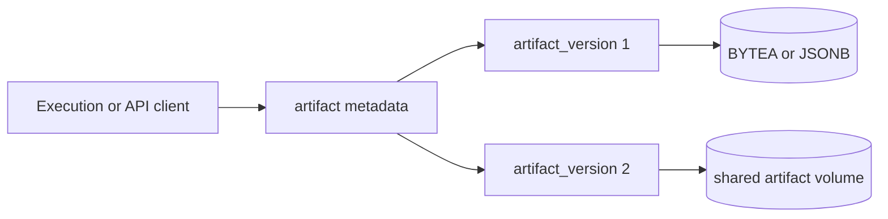

Artifacts are named outputs that outlive one process invocation. They cover files, URLs, progress streams, and other structured output. The parent record describes the artifact as a logical object. Version rows hold its content history.

See [Manage artifacts](/administration/artifacts/) for the public API and operator tasks.

## Representation

The [supporting systems migration](https://github.com/attune-system/attune/blob/main/migrations/20250101000007_supporting_systems.sql#L141-L295) defines `artifact` and `artifact_version`. Their Rust models and explicit select-column lists live in the [common models](https://github.com/attune-system/attune/blob/main/crates/common/src/models.rs#L1941-L2020).

| Table | Mutable? | Contents |
| --- | --- | --- |
| `artifact` | Yes | Ref, owner scope, type, visibility, classification, descriptive metadata, latest size and content type, retention policy, progress data |
| `artifact_version` | Limited | Monotonic version number, producing execution, content location, per-version metadata, creator, timestamp |

`artifact.scope` uses the shared owner types `system`, `identity`, `pack`, `action`, and `sensor`; `owner` is a text identifier interpreted with that scope. Artifact types are `file_binary`, `file_datatable`, `file_image`, `file_text`, `other`, `progress`, and `url`. Visibility is `public` or `private`.

The later [classification migration](https://github.com/attune-system/attune/blob/main/migrations/20250101000017_artifact_log_classification.sql) adds `general` and `runtime_log`. Runtime stdout and stderr artifacts are classified from their type and ref, and API validation prevents a runtime log from becoming public.

An artifact ref also participates in file-path derivation. New refs cannot contain path separators, empty segments, or traversal forms. `artifact_version.file_path` must remain a safe relative path. The database constraints were added as `NOT VALID` so old rows could remain during upgrades, but PostgreSQL enforces them for new and changed rows. See the [path constraint migration](https://github.com/attune-system/attune/blob/main/migrations/20250101000025_artifact_path_constraints.sql).

## Content and versions

A version can hold binary `content`, structured `content_json`, or a relative `file_path`. File-backed types normally store bytes on the shared artifact volume and retain only metadata and the relative path in PostgreSQL. This avoids loading large files into ordinary list queries. The repository's default version projection deliberately substitutes `NULL` for `content`; content-aware methods request the `BYTEA` column explicitly.

File-backed creation inserts a version before it knows the final relative path, then updates `file_path`. Worker finalization can also update `size_bytes`. The version number and finalized content are stable, but the database row is not strictly immutable during that write lifecycle.

`ArtifactVersionRepository::create` takes a transaction advisory lock keyed by artifact ID, computes `MAX(version) + 1`, and inserts the next 1-based version. This closes the concurrent-writer race around version numbers. See the [artifact repository](https://github.com/attune-system/attune/blob/main/crates/common/src/repositories/artifact.rs#L1525-L1572).

The database's after-insert trigger updates the parent's latest `size_bytes` and `content_type`. It also enforces `versions` retention by deleting the oldest excess rows. Time-based `days`, `hours`, and `minutes` policies are handled by retention work outside that trigger. Deleting an artifact cascades to its version metadata. File deletion needs storage-aware service code because PostgreSQL cannot remove a file from the shared volume.

Progress artifacts are different. Their current event list lives in mutable `artifact.data`, and `append_progress` appends one JSON value atomically. PostgreSQL notifications carry only a progress summary, not arbitrary file content.

## Execution interaction

Workers and API clients can create or reuse a logical artifact, allocate or upload a version, download content, and stream a growing file. `artifact_version.execution` records which execution produced that version. It is a plain `BIGINT`, not a foreign key, so retained artifact metadata can outlive an execution under independent retention policies.

The API resolves default retention first from a producing execution, then from an action or sensor, and finally from request or fallback defaults. Runtime logs use their own path through that logic. The route implementation is in [artifact routes](https://github.com/attune-system/attune/blob/main/crates/api/src/routes/artifacts.rs#L110-L211).

## Authorization

All artifact routes require authentication. Writes use `artifacts:create`, `update`, or `delete` with owner, ref, ID, visibility, and pack constraints. Execution linkage does not grant write authority.

Reads have a stricter rule. An unconstrained artifact read grant can read all artifacts. Otherwise, if any version links the artifact to an execution, execution visibility becomes the authoritative path. A caller may see the artifact when at least one linked execution is readable, but version reads are checked against that version's own execution. If no version has execution linkage, access falls back to owner scope and `public` or `private` visibility. The repository compiles this filtering into SQL in [`push_artifact_read_predicate`](https://github.com/attune-system/attune/blob/main/crates/common/src/repositories/artifact.rs#L654-L681).

The reserved execution permission ref `standard` grants an execution scoped artifact access for its action and pack ownership paths. It does not make artifacts public. See the [standard execution grants](https://github.com/attune-system/attune/blob/main/crates/api/src/authz.rs#L714-L773).

## Caveats

- `artifact.ref` is indexed but not globally unique. Code that mutates by ref treats ambiguity as unsafe rather than choosing a row.
- The parent `size_bytes` describes the latest inserted version, not total retained storage.
- Database version deletion and physical file deletion are separate operations.
- Public progress is the default for ordinary progress artifacts. Runtime logs are always private.
- A dangling execution ID does not permit owner-based fallback when execution linkage exists. The read path fails closed.
