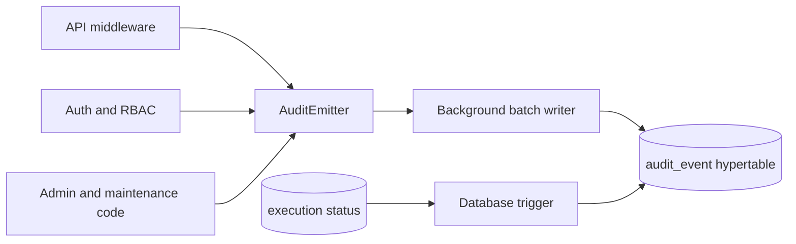

An audit event records a security-relevant or operator-relevant fact about Attune itself. It answers who acted, what resource was involved, what outcome occurred, and how related activity can be correlated. It is separate from trigger events: trigger events drive automation, while audit events describe use and administration of the platform.

## PostgreSQL representation

`audit_event` is a TimescaleDB hypertable partitioned on `created` with one-day chunks. Its primary key is `(id, created)`. The [audit-log migration](https://github.com/attune-system/attune/blob/main/migrations/20250101000013_audit_log.sql) defines seven categories and three outcomes.

| Group | Fields |
| --- | --- |
| Classification | `category`, dotted `event_type`, `outcome` |
| Actor snapshot | `actor_identity`, `actor_login`, token type, IP, user agent |
| Resource snapshot | `resource_type`, `resource_id`, `resource_ref` |
| HTTP context | method, path, status, duration, `request_id` |
| Structured context | redacted `details`, optional `correlation_chain` |

Categories are `api`, `auth`, `rbac`, `secret`, `admin`, `execution`, and `pack`. Outcomes are `success`, `failure`, and `denied`. Event types are dotted strings such as `auth.login.success` or `execution.completed`; the [audit module](https://github.com/attune-system/attune/blob/main/crates/common/src/audit/mod.rs) centralizes the known constants and Rust enums.

Actor and resource IDs are plain `BIGINT` snapshots without foreign keys. That is a retention choice: identity or resource deletion must not erase or rewrite the audit record. `actor_login` and `resource_ref` preserve readable names. Because `audit_event` is a hypertable, other tables also cannot treat `audit_event(id)` as a normal foreign-key target. The database key includes `created`, although the repository supports the uncommon all-chunk lookup by `id` alone.

There is no secondary history table. Audit events are append-only records. PostgreSQL compresses chunks older than seven days, segmented by category and actor identity.

## Writers and delivery guarantees

The API [audit middleware](https://github.com/attune-system/attune/blob/main/crates/api/src/middleware/audit.rs) assigns a request UUID and emits one generic record after most HTTP requests. It records the method, path, response status, duration, client information, and token claims when available. Health, readiness, generated API documentation, and audit-read endpoints are skipped to avoid operational noise and recursive logging. A `401` or `403` maps to `denied`; other errors map to `failure`.

Handlers and authorization code also emit semantic records for operations such as secret disclosure, permission changes, pack changes, retention configuration, and corrective maintenance. These records can share the middleware's `request_id`. The builder accepts a `correlation_chain` for linked rule, enforcement, execution, or parent-request IDs.

Most application writers use the cloneable [AuditEmitter](https://github.com/attune-system/attune/blob/main/crates/common/src/audit/emitter.rs). Emission returns immediately through an unbounded channel. The [background writer](https://github.com/attune-system/attune/blob/main/crates/common/src/audit/writer.rs) inserts up to 256 events per batch and flushes a partial batch after 200 milliseconds. This path is intentionally best-effort: a stopped writer or failed batch logs the error and drops events rather than fail the user request. Callers that need synchronization can request a flush, and central code can use `AuditRepository::insert` directly.

Execution lifecycle auditing has a different guarantee. A PostgreSQL trigger inserts an audit event after execution insertion or a status change. It maps requested, scheduled, started, completed, failed, timed out, canceling, cancelled, and abandoned states to execution event types. The trigger write participates in the execution transaction, so failure aborts that transaction. Its details include status, action ref, hierarchy, worker, enforcement, and retry identifiers, but not parameters or results.

## Secret handling and reads

Audit details must never contain raw secrets, tokens, decrypted key material, or artifact content. `AuditEventBuilder::with_redacted_params` recursively preserves JSON structure while replacing leaves with `"***"`. Emit sites remain responsible for choosing bounded, non-sensitive metadata. The database does not inspect arbitrary `details` JSONB and cannot repair a caller that inserts a secret.

The [audit repository](https://github.com/attune-system/attune/blob/main/crates/common/src/audit/repository.rs) filters by category, type, outcome, actor, resource, request UUID, HTTP values, and creation range. Results sort by `created DESC, id DESC`; request correlation sorts oldest first. The protected [audit API routes](https://github.com/attune-system/attune/blob/main/crates/api/src/routes/audit.rs) expose list, detail, and request-correlated reads and sanitize response details again. Each audit-log read emits a separate admin audit event through the asynchronous emitter. See [Visibility](/operations/visibility/) for the operator-facing observability model and [API reference](/reference/api/) for endpoint discovery.

## Retention and caveats

The supervisor owns audit retention. The default is 90 days, longer than the 30-day default for operational events and execution history. The [retention repository](https://github.com/attune-system/attune/blob/main/crates/common/src/repositories/retention.rs) drops complete hypertable chunks older than the configured `created` cutoff. Runtime configuration can change the age or keep records forever by setting the target age to `null`. See [Supervisor](/operations/supervisor/).

Do not describe this store as lossless. Database-triggered execution records are transactional, but emitter-based records can be lost during shutdown, channel failure, or database failure. Retention also removes records by policy. Deployments with compliance requirements must account for those guarantees, database backups, and access controls rather than infer permanence from the term "audit."
