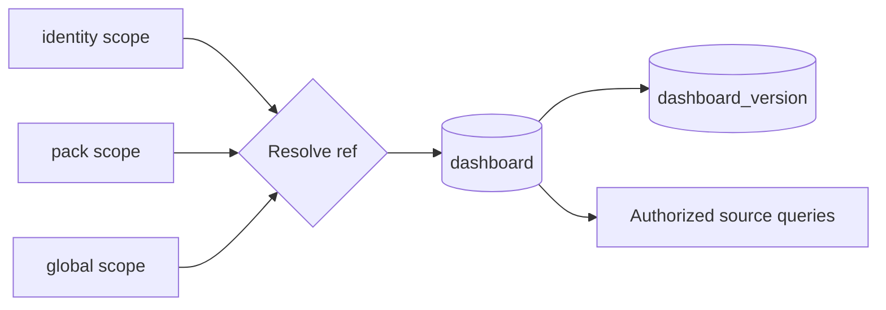

Dashboards are declarative operational views. A dashboard row combines lookup and authorization metadata with the current JSONB spec. A second table stores immutable spec revisions. Rendering does not copy operational data into the dashboard; the API evaluates named data sources against repositories when a client requests preview or dashboard data.

## PostgreSQL representation

| Record area | Meaningful columns |
| --- | --- |
| Scoped identity | `ref`, `scope_type`, `scope_ref` |
| Ownership | `pack`, `owner_identity`, `is_adhoc` |
| Access and selection | `visibility`, `enabled`, `is_default_home` |
| Current document | `spec_version`, `spec`, `revision` |
| Presentation | `label`, `description`, `tags` |
| History | `dashboard_version.dashboard`, `revision`, `spec_version`, `spec`, `created_by` |

The database makes `(scope_type, scope_ref, ref)` unique, so the same ref can exist in more than one scope. Scope types are `global`, `pack`, `identity`, and `tenant`. Visibility values are `private`, `pack`, and `public`. Scope says where a definition resolves; visibility says who may read it. The optional `pack` and `owner_identity` foreign keys supply concrete ownership links for pack-managed and identity-owned rows.

`spec` is the complete current declarative document. It contains defaults, filters, data sources, cards, layouts, and visualization settings. `spec_version` identifies the document schema. `revision` is the optimistic-concurrency counter for the row and increases on metadata or spec changes.

`dashboard_version` records immutable copies of the spec. Creation inserts revision 1 into both tables in one statement. Later updates add a version row only when `spec` or `spec_version` changes; metadata-only changes still increase `dashboard.revision` but do not create another spec snapshot.

## Scope resolution and default homes

For a ref requested by an authenticated identity, repository lookup checks identity scope first, then the pack scope inferred from the ref prefix, then global scope. This allows a personal or pack-specific definition to shadow a global definition with the same ref.

A partial unique index permits only one `is_default_home = true` row per `(scope_type, scope_ref)`. API writes take an advisory transaction lock, clear the previous default in that scope, and set the new one atomically. The database trigger provides the same uniqueness behavior for writes outside that API transaction.

## Lifecycle and interactions

Pack YAML under `dashboards/` loads as `is_adhoc = false` with pack ownership. The loader updates these rows on pack reload and removes non-ad-hoc rows no longer present in the pack. The dashboard API refuses update and delete operations on pack-managed rows; their files remain authoritative.

API and web-editor creation sets `is_adhoc = true` and records the creating identity where the selected scope requires it. Updates require `expected_revision`; a stale value returns a conflict rather than overwriting another editor's work. Clone creates a new ad-hoc dashboard with a new ref and an initial revision.

The API validates the spec before persistence. Preview validates and evaluates an unsaved document. Data execution indexes filters, data sources, and card references, then dispatches source-specific repository queries. Each source applies its own RBAC and ref constraints. Reading a dashboard never grants access to the events, executions, keys, queues, workers, or sensors referenced by its sources.

The web application routes `/dashboards/new` and `/dashboards/:ref/edit` to the dashboard editor. The normal dashboard page resolves and renders the selected stored document.

## Caveats

`revision` is broader than version history. A client cannot assume that every integer revision has a matching `dashboard_version` row. Version history is spec history, not a full metadata audit log.

The default-home trigger clears another dashboard by updating that row's revision. That automatic metadata update does not insert a `dashboard_version`, because its spec did not change.

`tenant` is a persisted scope variant, but tenant ownership is represented only by `scope_ref`; there is no tenant foreign key on `dashboard`. Authorization code must interpret that value rather than relying on relational integrity.

See [Writing dashboards](/pack-development/dashboards/) and [Operational visibility](/operations/visibility/).

Implementation sources: [dashboard migration](https://github.com/attune-system/attune/blob/main/migrations/20250101000018_dashboards.sql), [dashboard models](https://github.com/attune-system/attune/blob/main/crates/common/src/models.rs), [dashboard repository](https://github.com/attune-system/attune/blob/main/crates/common/src/repositories/dashboard.rs), [dashboard spec validation](https://github.com/attune-system/attune/blob/main/crates/common/src/dashboard_spec.rs), [dashboard API routes](https://github.com/attune-system/attune/blob/main/crates/api/src/routes/dashboards.rs), [dashboard web page](https://github.com/attune-system/attune/blob/main/web/src/pages/dashboard/DashboardPage.tsx), and [dashboard editor](https://github.com/attune-system/attune/blob/main/web/src/pages/dashboard/DashboardEditorPage.tsx).
