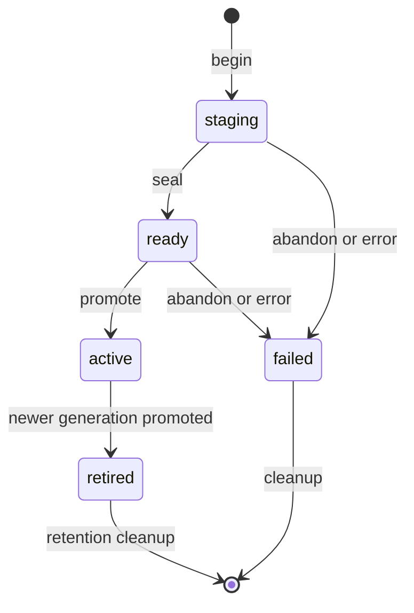

Data caches hold reconstructable snapshots copied from external systems. They are read-mostly datasets for automation, not mutable source-of-truth tables and not secret storage. A namespace names the dataset and its policy. A generation is one immutable snapshot. Entries belong to exactly one generation.

See [Manage data caches](/administration/data-caches/) for API operations and [Iterate over cache data](/pack-development/cache-iteration/) for workflow use.

## Representation

The [cache migration](https://github.com/attune-system/attune/blob/main/migrations/20250101000021_cache.sql) creates the main tables. The [physical byte accounting migration](https://github.com/attune-system/attune/blob/main/migrations/20250101000024_cache_physical_byte_accounting.sql) adds aggregate admission counters.

| Table | Role |
| --- | --- |
| `cache_namespace` | Owner, namespace name, active-generation pointer, freshness target, quotas, management provenance, tombstone state |
| `cache_generation` | Refresh identity, expected upload shape, state, counts, source revision, timestamps, failure details |
| `cache_entry` | Immutable `external_id` and JSON value within one generation |
| `cache_ingest_chunk` | Idempotency checksum and accepted count and size for one upload chunk |
| `cache_*_physical_byte_usage` | Deployment-wide and owner-wide physical usage counters |
| `workflow_cache_iteration` | Durable workflow scan cursor and generation retention pin |

The owner types are `system`, `identity`, `pack`, `action`, and `sensor`. The database trigger requires the matching canonical owner ID, while cached pack, action, and sensor refs support stable API addressing. A live namespace is unique by owner type, canonical owner, and namespace. Pack-managed definitions also carry `definition_ref`, `managing_pack`, and `managing_pack_ref`; an API-created namespace has none of those fields.

Each entry's `external_id` is unique within a generation under bytewise `C` collation. Scans use the same ordering, which makes keyset cursors deterministic. Entry values are JSONB and limited to 1 MiB. The database computes `size_bytes`; it is an accounting value, not the serialized HTTP response size.

## Refresh publication

Writers never update active entries. They build a copy-on-write generation and swap one namespace pointer.

1. Begin creates `staging` with a client refresh ID, expected chunk count, optional expected records and bytes, source revision, and expected active generation. Replaying the same ID with the same metadata returns the existing generation.
2. Upload inserts entries and a `cache_ingest_chunk` in one transaction. The same chunk index and request checksum is a no-op replay; a different checksum conflicts. Duplicate external IDs fail the whole chunk.
3. Seal requires contiguous chunks from zero, reconciles chunk totals with actual entries, checks expected totals and namespace quotas, and changes `staging` to `ready`.
4. Promote compares the namespace's current pointer with `expected_active_generation`. On a match, one transaction retires the prior active generation, activates the ready generation, updates the pointer, and clears the refresh-failure streak.

The repository implementation is in [`CacheGenerationRepository`](https://github.com/attune-system/attune/blob/main/crates/common/src/repositories/cache.rs#L1360-L1900) and [`CacheIngestRepository`](https://github.com/attune-system/attune/blob/main/crates/common/src/repositories/cache.rs#L1989-L2190). The database trigger also rejects invalid generation transitions and entry writes outside `staging`.

Promotion uses optimistic concurrency rather than a force option. A writer that started from an old active generation must restart or deliberately reconcile with current state. Retired generations remain readable until `readable_until`, giving in-flight clients a bounded traversal window.

## Reads and workflow pins

Normal point and multi-ID reads use the active generation. Scans pin a generation ID and continue by the last external ID. The API signs opaque cursors with HMAC and bounds pages by row count and serialized bytes. A pinned read accepts the active generation or an unexpired retired generation. Otherwise it returns a snapshot-expired error rather than silently switching datasets.

Native workflow `iterate_cache` records its generation and cursor in `workflow_cache_iteration`. While a non-terminal workflow is scanning, cleanup treats that row as a retention pin even after the generation's ordinary readable window ends. The [workflow cache iteration migration](https://github.com/attune-system/attune/blob/main/migrations/20250101000023_workflow_cache_iteration.sql) constrains page size, batch size, concurrency, and progress counters.

## Ownership, authorization, and cleanup

Every cache route uses `RequireAuth`, then authorizes before looking up the namespace. Access and execution tokens use `caches` grants. Constraints can name an owner type, owner ref, and namespace through `refs`. Sensor tokens use signed cache authority instead of identity RBAC. Other token types fail closed. The route contract is documented in the [cache route module](https://github.com/attune-system/attune/blob/main/crates/api/src/routes/cache.rs#L1-L109).

The reserved execution access ref `standard` grants read-only cache access for the relevant pack and action owner scopes. Refresh operations need explicit `create`, `update`, or `delete` grants.

Deleting a namespace tombstones it and clears the active pointer immediately. Staging and ready generations fail; the active generation retires. Bounded supervisor cleanup later deletes entries, chunk metadata, generations, and finally the empty tombstoned namespace. Pack definition removal and owner deletion use this same lifecycle. Identity deletion pauses while owned cache namespaces drain.

## Caveats

- Freshness is derived from active-generation activation time and `freshness_target_seconds`. It does not poll the source system.
- Whole-generation checksums are not supported until Attune defines canonical JSON encoding. Per-chunk request checksums provide upload idempotency.
- Retention limits include at least the active and one prior generation, so `max_retained_generations` cannot be less than two.
- Values are not encrypted by the cache subsystem. Do not copy credentials into cache entries.
