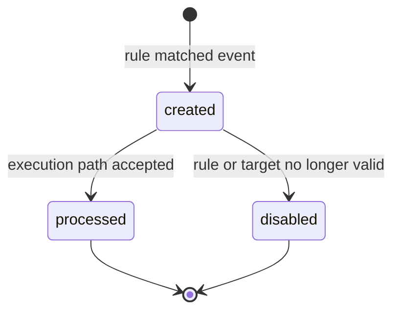
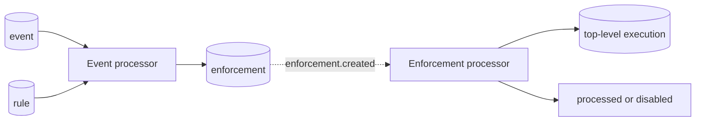

An enforcement records that one rule matched one event and captures the action parameters produced by that match. It is the durable boundary between event evaluation and execution scheduling. Events say what happened; enforcements say which rule accepted it and what that rule asked Attune to run. See [Rules](/pack-development/rules/) for the author-facing condition and parameter syntax.

## PostgreSQL representation

The current `enforcement` table is an ordinary PostgreSQL table, not a TimescaleDB hypertable. The [event-system migration](https://github.com/attune-system/attune/blob/main/migrations/20250101000004_trigger_sensor_event_rule.sql) defines its columns and indexes. The current HA design keeps it relational so PostgreSQL can enforce idempotency with a partial unique index on `(rule, event)` when both values are present.

| Column | Meaning |
| --- | --- |
| `id`, `created` | Stable `BIGINT` identity and creation time |
| `rule`, `rule_ref` | Nullable rule foreign key and retained ref |
| `trigger_ref` | Trigger ref copied from the rule |
| `event` | Plain event ID without a foreign key |
| `config` | Resolved, flat action parameter map |
| `payload` | Event payload used for evaluation |
| `condition`, `conditions` | `all` or `any`, plus the condition definitions |
| `status`, `resolved_at` | Narrow processing lifecycle |

`enforcement.rule` references the regular `rule` table with `ON DELETE SET NULL`. `enforcement.event` cannot reference `event(id)`: `event` is a hypertable whose primary key is `(id, created)`. The plain `BIGINT` can dangle when event retention drops an old chunk. `execution.enforcement`, by contrast, is a normal foreign key because both `enforcement` and `execution` are ordinary tables. Deleting an enforcement sets that execution field to `NULL`.

There is no `enforcement_history` table. Enforcements make one short transition after insertion, so the live row carries enough state. The `enforcement_volume_hourly` view groups rows directly by `created` and `rule_ref`. Secret action parameters are redacted in `config`; encrypted values live in `execution_secret_value` under the `enforcement_config` entity type.

## Lifecycle and ownership

The executor owns this lifecycle in two stages. The [event processor](https://github.com/attune-system/attune/blob/main/crates/executor/src/event_processor.rs) consumes `event.created`, reloads the event, selects enabled rules, evaluates their conditions, resolves templates, and validates secret destinations against the action schema. It then calls `EnforcementRepository::create_or_get_by_rule_event`. The unique index and `ON CONFLICT DO NOTHING` make duplicate RabbitMQ delivery converge on one row.

The event processor publishes `enforcement.created` after creating or recovering a still-`created` row. The [enforcement processor](https://github.com/attune-system/attune/blob/main/crates/executor/src/enforcement_processor.rs) reloads that row and ignores duplicate messages once the status has left `created`. It verifies that the rule remains enabled and still has an action and trigger. A valid enforcement creates, or recovers, one top-level execution. A partial unique index on `execution.enforcement` supplies the second idempotency boundary.

After the execution path succeeds, the processor conditionally changes `created` to `processed` and sets `resolved_at`. If the rule or target is no longer usable, it changes the row to `disabled`. The conditional update prevents two executor replicas from resolving the same row twice. The processor copies encrypted parameter records to the execution only when it creates a new execution.

PostgreSQL emits `enforcement_created` and `enforcement_status_changed` notifications for live clients. RabbitMQ carries executor work. These similarly named channels are independent; the [Notifier WebSocket](/internal-implementation/supporting-systems/notifier-websocket/) stream is best-effort and has no replay.

## API and substantial interactions

The [events and enforcements API module](https://github.com/attune-system/attune/blob/main/crates/api/src/routes/events.rs) supplies paginated list and detail reads. Filters include rule, event, status, trigger ref, rule ref, and trace tag. Visibility follows the referenced rule. The API can restore encrypted parameter values only for a caller with the required decrypt grant, and that disclosure produces a secret-access audit event. [Permissions and RBAC](/administration/permissions-and-rbac/) describes the public authorization model.

An enforcement snapshots more than linkage. `payload`, `conditions`, and resolved `config` let contributors inspect what the executor acted on even if a rule later changes. `rule_ref` and `trigger_ref` remain after definition deletion. The numeric `event` field does not promise that the event remains available.

## Retention and caveats

The supervisor retains enforcements for 30 days by default. Unlike event retention, it performs bounded row deletes. The [retention repository](https://github.com/attune-system/attune/blob/main/crates/common/src/repositories/retention.rs) deletes only rows older than the `created` cutoff whose status is not `created`, up to the configured batch size each cycle. An unresolved `created` enforcement is not age-purged. See [Supervisor](/operations/supervisor/) for configuration and lag monitoring.

Do not model enforcement as a general workflow state machine. Its statuses only describe whether executor intake remains pending, produced an execution path, or was disabled. Execution failure does not move a processed enforcement back to `created`. Retries and cancellation belong to the execution records that follow it.
