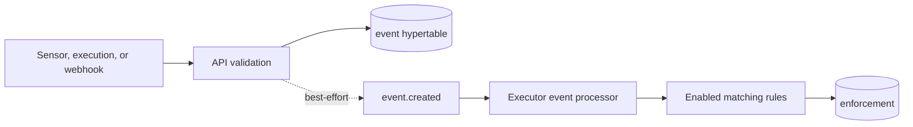

An event is a durable record that a trigger fired. It separates event production from rule evaluation: a sensor, an action execution, or the webhook receiver can record an occurrence before the executor decides which rules match it. See [Core concepts](/introduction/core-concepts/) for the public event flow and [Sensors](/pack-development/sensors/) for authoring guidance.

## PostgreSQL representation

The `event` table starts as a regular table in the [trigger, sensor, event, and rule migration](https://github.com/attune-system/attune/blob/main/migrations/20250101000004_trigger_sensor_event_rule.sql). The [TimescaleDB history migration](https://github.com/attune-system/attune/blob/main/migrations/20250101000009_timescaledb_history.sql) converts it to a hypertable partitioned on `created`, with one-day chunks. The conversion replaces the original primary key with `(id, created)`, as TimescaleDB requires the partition column in a unique index.

| Column group | Stored value |
| --- | --- |
| Identity | `id`, `created`, and optional `trace_tag` |
| Trigger | Nullable `trigger` ID and required `trigger_ref` snapshot |
| Producer | Nullable `source` sensor ID and `source_ref` snapshot |
| Targeted rule | Optional `rule` ID and `rule_ref` |
| Event data | Optional `config` and `payload` JSONB objects |

`trigger`, `source`, and `rule` are foreign keys from the hypertable to regular definition tables. Deleting one of those definitions sets the numeric column to `NULL`; the adjacent ref remains useful for retained events. The inverse relationship is different. A table cannot use `event(id)` as a foreign-key target because the event key includes `created` and the table is partitioned. `enforcement.event` is therefore a plain `BIGINT`. It can dangle after event retention removes its event.

Events have no `event_history` table. They are immutable in application code: [EventRepository](https://github.com/attune-system/attune/blob/main/crates/common/src/repositories/event.rs) implements create, read, search, and delete, but no update. The live hypertable is the time-series record. `event_volume_hourly` reads it directly for analytics.

Event ingestion checks `trigger.param_schema` for protected fields in both config and payload. It replaces matching values with markers and stores encrypted values in `execution_secret_value`, using the `event_payload` or `event_config` entity type. This supporting table uses a logical `entity_id`, not a foreign key. Ingestion does not consult `out_schema`, so an output-only secret marker does not protect a payload field.

## Creation and processing

The protected `POST /api/v1/events` route accepts only sensor and execution tokens. User sessions must use an enabled trigger webhook. The [events route](https://github.com/attune-system/attune/blob/main/crates/api/src/routes/events.rs) verifies the trigger, token scope, sensor ownership, workload-assignment fence, and any `rule_<id>` target before it inserts the row. An execution-token request inherits its parent execution's trace tag unless the request supplies one.

Webhook ingestion performs its own authentication, HMAC, IP, and rate-limit checks, then uses the same repository. Work-queue lifecycle code and supervisor alerts can also create system events through repository-backed helpers.

After the transaction commits, the API publishes an `EventCreated` RabbitMQ message when a publisher is available. Publication failure does not roll back the event. The [executor event processor](https://github.com/attune-system/attune/blob/main/crates/executor/src/event_processor.rs) reloads the event from PostgreSQL. If `event.rule` is set, it considers only that rule. Otherwise, it finds enabled rules for `trigger_ref`. For each rule whose conditions pass, it resolves action parameters and creates one enforcement for the `(rule, event)` pair.

PostgreSQL also emits `event_created` through `LISTEN/NOTIFY` after insertion. The notifier uses that channel for live client updates. This notification is not the executor's durable work queue. See [RabbitMQ](/internal-implementation/supporting-systems/rabbitmq/) and [Notifier WebSocket](/internal-implementation/supporting-systems/notifier-websocket/) for the two delivery contracts.

## Queries and visibility

The API exposes list and detail reads through the same [events route](https://github.com/attune-system/attune/blob/main/crates/api/src/routes/events.rs). Repository searches filter by ID, trigger, source, rule ref, or trace tag and order by newest `created`. Read visibility derives from accessible rules for events that produced enforcements. For an event with no enforcement, visibility derives from its trigger. Secret values stay redacted unless the caller passes the separate decrypt authorization path.

Trace reports join events to enforcements and executions by their plain numeric links. Code must tolerate a missing event because retention can break that chain.

## Retention and caveats

The supervisor owns event retention. The database seed keeps 30 days by default, but administrators can change or disable that target at runtime. For `events`, the [retention repository](https://github.com/attune-system/attune/blob/main/crates/common/src/repositories/retention.rs) calls TimescaleDB `drop_chunks` on `created`; it does not delete rows one at a time. Chunks older than seven days are also eligible for TimescaleDB compression. See [Supervisor](/operations/supervisor/) for runtime settings.

Event insertion and RabbitMQ publication are not transactional together. A committed event can exist without a corresponding queue message if publication fails. Also, `id` comes from a sequence and repository lookups use it alone, but the database primary key is `(id, created)`. Contributors adding references or conflict constraints must design against the composite key and retention behavior, not assume that `event(id)` is a relational target.
