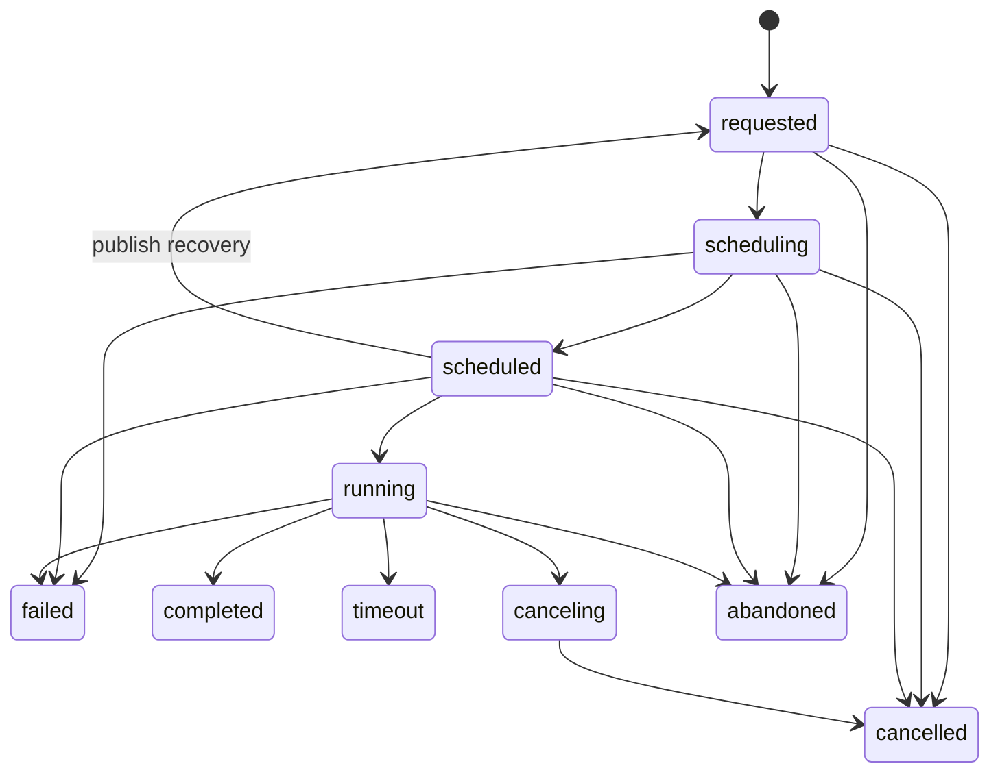

An execution is one attempt to run an action. Manual requests, rule enforcements, workflow tasks, and work-queue dispatches all converge on this record. The row is both the scheduler's unit of work and the API's current-state view. It is deliberately mutable; a separate history stream records selected changes.

## PostgreSQL representation

The current `execution` table is an ordinary PostgreSQL table, not a TimescaleDB hypertable. The [execution migration](https://github.com/attune-system/attune/blob/main/migrations/20250101000005_execution_and_operations.sql) defines the row, its indexes, and its foreign keys. Keeping it relational permits self-referencing hierarchy keys, workflow cascades, inquiry ownership, and uniqueness constraints used for duplicate delivery.

| Column group | Important fields |
| --- | --- |
| Target and input | `action`, `action_ref`, flat `config`, `env_vars` |
| Ownership | `executor`, `worker`, `enforcement`, `parent` |
| Scheduling inputs | placement overrides, `timeout_seconds`, artifact retention |
| Access snapshot | `permission_set_refs` |
| State and output | `status`, `started_at`, `result`, `created`, `updated` |
| Correlation | immutable `trace_tag` and workflow task metadata |
| Retry chain | `retry_count`, `max_retries`, `retry_reason`, `original_execution` |

`action`, `executor`, and `worker` use nullable foreign keys with `ON DELETE SET NULL`. `parent` and `original_execution` self-reference `execution(id)`. `enforcement` also uses `ON DELETE SET NULL`. These links do not dangle under normal foreign-key operation. Other operational tables intentionally use plain execution IDs where independent retention matters. For example, `artifact_version.execution` has no foreign key, so an artifact version can outlive its execution.

The Rust [Execution model and repository](https://github.com/attune-system/attune/blob/main/crates/common/src/repositories/execution.rs) use an explicit column list because the database-only `workflow_def` column is absent from the public model. Do not use `SELECT *` for this row.

## Lifecycle and service ownership

The API, enforcement processor, workflow scheduler, and queue dispatcher create `requested` rows. Creation snapshots the resolved timeout, artifact retention, permission sets, and any explicit placement override. If an execution has no placement override, the scheduler loads the current action and pack defaults. An edit made before scheduling can therefore change placement for an existing request. The executor claims `requested` as `scheduling`, applies policies, selects a worker, and moves the row to `scheduled`. The worker owns runtime transitions and result production once work starts. The supervisor can repair stale non-terminal states. See [Architecture](/introduction/architecture/) and [RabbitMQ](/internal-implementation/supporting-systems/rabbitmq/) for the service flow.

`permission_set_refs` is the authorization snapshot for the execution-scoped token. An empty array means the worker omits `ATTUNE_API_TOKEN`. A rule can override the action defaults; workflow tasks can supply their own resolved sets. This snapshot prevents later definition edits from silently changing a running action's access.

Cancellation is cooperative for running work. The [execution API](https://github.com/attune-system/attune/blob/main/crates/api/src/routes/executions.rs) immediately marks pre-worker states `cancelled`. It changes a running execution to `canceling` and sends a worker message. The worker sends an interrupt, then terminates the process after its grace period. Cancelling a workflow also cancels incomplete children and marks its workflow state so no new tasks dispatch.

## Workflow tasks, inquiries, and retries

A workflow has one parent execution plus one `workflow_execution` row containing task sets, variables, the task graph, pause state, and orchestration status. Child actions are ordinary executions whose `parent` points to the workflow execution row's parent execution. Their `workflow_task` JSONB names the workflow state record, task, item index or batch, retry counters, timing, and triggering predecessor. `workflow_task_dispatch` claims `(workflow_execution, task_name, task_index)` before child creation, which prevents duplicate dispatch across executor replicas. The [workflow schema migration](https://github.com/attune-system/attune/blob/main/migrations/20250101000006_workflow_system.sql) defines these supporting records. See [Workflows](/pack-development/workflows/) for authoring behavior.

Inquiries are one-to-one supporting records for executions waiting on human input. `inquiry.execution` has `ON DELETE CASCADE`; statuses are `pending`, `responded`, `timeout`, and `cancelled`. The executor creates inquiries from action results, resumes work after response messages, and checks timeouts. Inquiry retention separately deletes terminal rows after their configured age.

Retries create new execution rows rather than resetting failed rows. `original_execution` points to the first attempt, while `retry_count`, `max_retries`, and `retry_reason` identify the attempt. Workflow retries also update the child `workflow_task` metadata and use the latest attempt per item when deciding task state. This preserves each attempt's result and history.

## History and artifacts

The `execution_history` table is a one-day-chunk TimescaleDB hypertable populated only by the `record_execution_history()` database trigger. It stores insert and delete markers plus field-level updates. Tracked updates include status, result, executor, worker, workflow metadata, environment variables, trace tag, and start time. Large result values appear as `{digest, size, type}` summaries, not full output. The [history migration](https://github.com/attune-system/attune/blob/main/migrations/20250101000009_timescaledb_history.sql) and [trace-tag migration](https://github.com/attune-system/attune/blob/main/migrations/20250101000015_trace_tags.sql) define the current trigger.

Execution artifacts are separate `artifact` and `artifact_version` records. Versions may hold bytes, JSON, or a file path, and their plain `execution` ID can outlive the execution row. File-backed version rows can change during creation and finalization, but their version number and finalized content remain stable. Action output logs use artifact retention settings separate from execution-row retention. See [Artifacts](/administration/artifacts/).

## Retention and caveats

The supervisor defaults both executions and execution history to 30 days. It batch-deletes only terminal execution rows whose `updated` time is older than the cutoff. It drops old history chunks by `time`. The two targets are independent, so either side can disappear first after configuration changes. Foreign-key cascades remove workflow state and inquiries when an execution is deleted; plain references such as artifact version IDs may remain. [Supervisor](/operations/supervisor/) lists the current defaults and corrective actions.

History is selective, not a complete row archive. The live `result` is lost with the execution, and its history keeps only a digest. Code that needs durable output must write an artifact rather than rely on execution retention.
