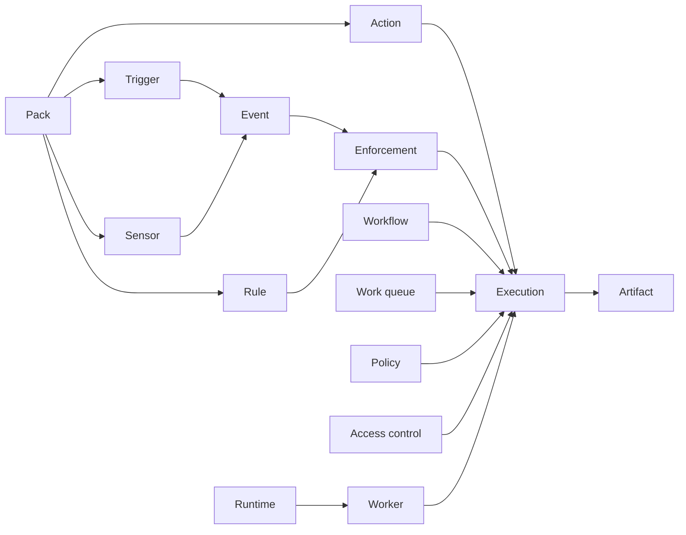

The data pages follow concepts exposed in the web client or CLI. Supporting tables stay with the concept they implement, so artifact versions belong to Artifacts and cache generations belong to Data caches.

## Primary relationship map

## Common representation rules

- Primary IDs are PostgreSQL `BIGINT` values represented as Rust `i64` values.
- Stable refs such as `core.echo` often remain beside nullable numeric relationships so retained operational records still identify deleted definitions.
- Packs own most authored definitions.
- Attune schemas use a flat per-field format, not raw JSON Schema.
- `event`, `enforcement`, and `execution` are treated as retention-sensitive operational records. References to them may be plain `BIGINT` values and may dangle after retention.
- Mutable execution and worker state has trigger-maintained history.
- JSONB stores authored schemas, placement rules, snapshots, parameters, results, and other shapes that do not merit separate relational tables.

## Page groups

| Group | Concepts |
| --- | --- |
| Authored definitions | Packs, actions, workflows, runtimes and workers, triggers, sensors, rules, policies, dashboards |
| Runtime records | Events, enforcements, executions and their inquiries, audit events |
| Data and access | Work queues, artifacts, keys and secrets, data caches, access control |

Each page describes intent, database representation, substantial interactions, and caveats. For authoring syntax or administrative procedures, follow its links back to the task-oriented docs.
