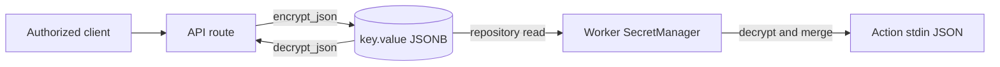

The `key` data structure stores small configuration values and secret material. A key can contain any JSON value. The `encrypted` flag says whether `value` contains that JSON value directly or an authenticated ciphertext representation.

Keys are not data caches, artifact content, JWT signing keys, or integration tokens. Those structures have different ownership and lifecycle rules.

## Representation and references

The original table is in the [supporting systems migration](https://github.com/attune-system/attune/blob/main/migrations/20250101000007_supporting_systems.sql#L13-L139). The [canonical key ref migration](https://github.com/attune-system/attune/blob/main/migrations/20260831000001_canonical_key_refs.sql) adds `local_ref` and makes `ref` a database-derived value.

| Field group | Purpose |
| --- | --- |
| `local_ref`, `ref`, `name` | Stable local identifier, canonical global reference, and display or merge name |
| `owner_type`, `owner_*`, cached owner refs | Exactly one system, identity, pack, action, or sensor ownership scope |
| `encrypted`, `encryption_key_hash`, `value` | Storage mode, configured-key check, and JSONB plaintext or ciphertext |
| `created`, `updated` | Lifecycle timestamps |

Canonical refs include the owner kind and durable owner name. Examples follow these forms: `system.<local_ref>`, `identity.<login>.<local_ref>`, `pack.<pack_ref>.<local_ref>`, `action.<action_ref>.<local_ref>`, and `sensor.<sensor_ref>.<local_ref>`. The trigger resolves canonical owner fields and computes `ref`. It rejects changes to ownership or `local_ref`, so moving a key means creating another key rather than renaming its identity.

The database enforces one key per owner and `name`, plus a globally unique canonical ref. Action and sensor owner rows cascade on deletion. Pack- and identity-owned keys use restrictive foreign keys, so they must be removed before the owner. The [key model and repository](https://github.com/attune-system/attune/blob/main/crates/common/src/repositories/key.rs) expose updates only for `name`, `value`, encryption status, and the encryption-key hash.

## Encryption and handling

For an encrypted key, the API calls the shared `encrypt_json` function before repository insertion. The crypto module uses AES-256-GCM with a random nonce and derives the encryption key from the configured encryption-key string. PostgreSQL receives a JSON string containing Base64-encoded nonce and ciphertext bytes, not the original JSON. `encryption_key_hash` lets the worker detect that the configured key differs from the key used for encryption. It is not a password verifier and cannot decrypt the value.

The API decrypts encrypted values on direct reads only after a successful `keys:decrypt` check. A caller with `keys:read` but no decrypt grant receives key metadata with a null value, never ciphertext. List responses always use summaries with values redacted. Create and update responses include the submitted value after authorization; update requires `keys:update` but does not separately require `keys:decrypt`. Create, update, read, decrypt, and delete operations emit audit records whose details omit key material. See the [key routes](https://github.com/attune-system/attune/blob/main/crates/api/src/routes/keys.rs) and [shared crypto implementation](https://github.com/attune-system/attune/blob/main/crates/common/src/crypto.rs).

Unencrypted keys store their JSON directly. They still pass through RBAC, but database access or backups expose their values. Contributors must not treat `encrypted: false` as secret storage.

## Execution delivery

At execution time, the worker's [`SecretManager`](https://github.com/attune-system/attune/blob/main/crates/worker/src/secrets.rs#L53-L194) loads system keys, then the action's pack keys, then action-owned keys. Later scopes replace earlier values with the same `name`. Identity- and sensor-owned keys do not participate in this action inheritance path.

The worker decrypts encrypted values in memory. It then merges key values into the action parameter document and writes one JSON line to the child process's standard input. The old `SECRET_*` environment conversion remains as a deprecated helper and is not the normal delivery path. Current stdin handling is in the [runtime process implementation](https://github.com/attune-system/attune/blob/main/crates/worker/src/runtime/process.rs#L919-L1037).

Separately, secret fields inside an execution's submitted parameters can be redacted from `execution.config` and stored as encrypted `execution_secret_value` rows. The worker restores those fields before launch. Those rows protect secret action parameters; they are not `key` records and do not gain canonical key refs.

## Authorization and ownership

All key API routes use `RequireAuth`. Grants use the `keys` resource and can constrain owner type, owner ref, canonical key ref, numeric ID, identity ownership, and encrypted status. Identity-owned keys receive an extra fail-closed rule: an unconstrained grant does not expose another identity's keys. Access to another identity requires a constrained matching grant.

`read` and `decrypt` are separate actions. `create`, `update`, and `delete` evaluate the target ownership context. An update that replaces or re-encrypts a value checks `update`, not `decrypt`. The repository pushes list visibility into SQL so pagination totals cover only readable rows.

An execution token does not inherit the initiating user's grants. Named `permission_set_refs` define its grants. The reserved `standard` ref adds read and decrypt access only to keys owned by the executing action, its pack, and, for workflow children, the containing workflow context encoded in the token. See [Permissions and RBAC](/administration/permissions-and-rbac/).

## Caveats

- Losing or changing the configured encryption key makes existing encrypted values unreadable until the original key is restored or values are re-encrypted.
- Encryption protects stored material. The worker must hold plaintext while preparing an action, so logs and error messages must never include values.
- `name` controls override behavior during action secret merging; `local_ref` controls canonical addressing. They are not interchangeable.
- Direct database readers bypass API redaction. Database and backup access remain sensitive.
