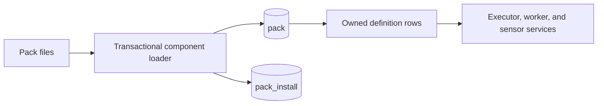

Packs are the ownership and distribution boundary for automation content. A pack groups actions, workflows, runtimes, triggers, sensors, rules, policies, dashboards, queues, permission sets, and caches under a stable lowercase `ref`. The files in a pack are the authored form. PostgreSQL holds the loaded form that services query at runtime.

## PostgreSQL representation

The central `pack` row stores identity, configuration, dependency declarations, placement constraints, and installation provenance. Its numeric `id` is a `BIGSERIAL`; the Rust model exposes all primary IDs as `i64` through the shared `Id` alias.

| Area | Meaningful columns |
| --- | --- |
| Identity | `ref`, `label`, `description`, `version`, `is_standard` |
| Configuration | `conf_schema`, `config`, `meta`, `tags` |
| Dependencies | `runtime_deps`, `dependencies`, `installers` |
| Placement | `worker_selector`, `worker_tolerations`, `worker_affinity` |
| Provenance | `source_type`, `source_url`, `source_ref`, `checksum`, `checksum_verified`, `installed_at`, `installed_by`, `installation_method`, `storage_path` |
| State | `install_status`, `created`, `updated` |

`ref` is unique, lowercase, and constrained to the pack-ref format. `version` must match the migration's semantic-version pattern. The three placement documents are JSONB values inherited by pack actions, sensors, and pack tests.

`conf_schema` uses Attune's flat per-field schema format, not raw JSON Schema. Each top-level key names one configuration field, and attributes such as `type`, `required`, `default`, and `secret` live in that field's object. `config` is the corresponding flat value map. Although the migration comment calls `conf_schema` JSON Schema, the current loader and validation contract is the flat form shared by `param_schema` and `out_schema`.

Several tables support pack management without becoming part of the `Pack` model. `pack_registry_index` stores ordered registry sources and request headers. `pack_install` records each installation attempt, including a status, test-result snapshot, and error. Its `pack_id` is deliberately a plain `BIGINT`, so a failed installation record survives rollback and deletion of a newly created pack row. Pack test and runtime-environment tables record validation and generated environment work separately.

## Loading and ownership

The component loader runs one database transaction. It preflights cache definitions and component ownership, then loads permission sets, runtimes, triggers, actions, dashboards, queues, policies, rules, sensors, and caches in dependency order. After loading, it removes non-ad-hoc definitions that no longer exist in the pack files. This makes the installed file set authoritative for pack-managed records while preserving separately created ad-hoc records.

Most owned definition tables have a foreign key to `pack(id)` with `ON DELETE CASCADE`. Deleting a pack therefore removes its current pack-managed definitions. Operational records often retain denormalized refs, such as `pack_ref` or `action_ref`, so history remains identifiable after a definition disappears. RBAC ownership is not a column on `pack`; authorization grants and owner constraints supply that layer.

## Caveats

`config` is ordinary JSONB, not encrypted secret storage. A schema field marked `secret` controls schema semantics and presentation but does not turn the pack row into a secret store. Sensitive values belong in keys.

The pack row's `install_status` has `pending`, `installed`, and `install_failed` values. The supporting `pack_install.status` has a separate attempt lifecycle: `pending`, `running`, `succeeded`, `failed`, or `rolled_back`. Do not treat the two columns as the same state machine.

Pack refs and component refs are denormalized into many child rows for filtering and retained identification. Code that changes a ref must account for those copies; the normal installation paths treat refs as stable identifiers.

See [Pack administration](/administration/packs/) and the [pack development overview](/pack-development/overview/) for operator and author workflows.

Implementation sources: [pack migration](https://github.com/attune-system/attune/blob/main/migrations/20250101000002_pack_system.sql), [pack placement migration](https://github.com/attune-system/attune/blob/main/migrations/20260821000001_pack_worker_placement.sql), [install-state migration](https://github.com/attune-system/attune/blob/main/migrations/20260818000002_pack_install_status.sql), [Pack model](https://github.com/attune-system/attune/blob/main/crates/common/src/models.rs), [pack repository](https://github.com/attune-system/attune/blob/main/crates/common/src/repositories/pack.rs), [component loader](https://github.com/attune-system/attune/blob/main/crates/common/src/pack_registry/loader.rs), [pack API routes](https://github.com/attune-system/attune/blob/main/crates/api/src/routes/packs.rs), and [pack web routes](https://github.com/attune-system/attune/blob/main/web/src/App.tsx).
