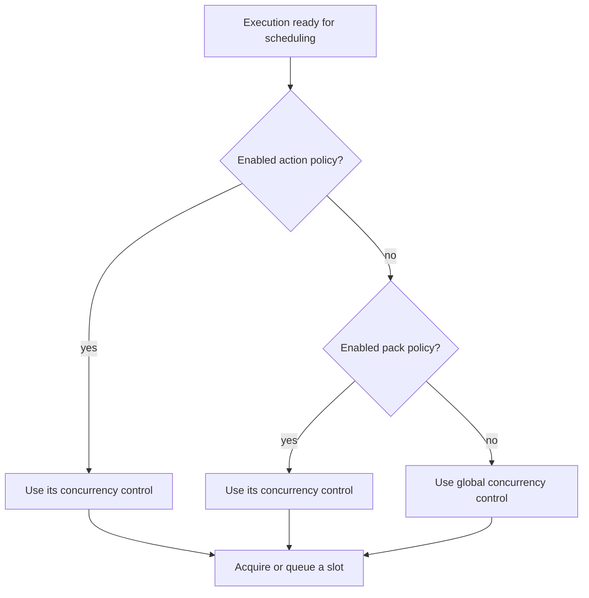

Policies control whether and when an execution may enter scheduling. They apply at global, pack, or action scope and can combine concurrency control, a rolling rate limit, and resource quotas in one row. Policies are execution controls, not RBAC grants: authorization decides who may request work, while policy enforcement limits admitted work.

## PostgreSQL representation

Scope is encoded by nullable foreign keys rather than a scope enum on the table. A row with `action` set is action-scoped. A row with `pack` set and no action is pack-scoped. A row with neither is global. The API exposes this as a `global`, `pack`, or `action` tagged scope.

| Feature | Columns | Meaning |
| --- | --- | --- |
| Precedence | `enabled`, `priority`, `created` | Selects the effective row at a given scope |
| Concurrency | `threshold`, `method`, `parameters` | Limits simultaneous action slots, optionally grouped by parameter paths |
| Rate limit | `rate_limit_max_executions`, `rate_limit_window_seconds` | Limits execution count in a rolling window |
| Quotas | `quotas` | Typed JSONB entries with `quota_type` and `limit` |
| Scope | `pack`, `pack_ref`, `action`, `action_ref` | Connects the control to global, pack, or action work |
| Metadata | `ref`, `name`, `description`, `tags` | Stable identity and presentation |

The database requires concurrency's `threshold` and `method` to be both null or both present. Positive-value checks apply to concurrency and rate-limit values. Every policy must configure at least one of concurrency, rate limiting, or a non-empty quota array. `method` is either `enqueue` or `cancel`.

The API currently accepts only `running_executions` and `executions_total` quota types. `quotas` remains JSONB so the typed list can grow without a separate table, but route validation rejects unknown types before persistence.

## Resolution and enforcement

The repository chooses one enabled row within each scope, ordered by descending `priority` and then descending `created`. The production scheduling path queries these rows when it resolves concurrency. It checks action scope first, then pack, then global. It does not merge one feature from each scope.

Concurrency uses an execution queue manager when available. `enqueue` reserves a slot or places the execution in FIFO waiting state; `cancel` rejects the attempt when no slot is available.

`parameters` contains paths into the flat execution config. For concurrency, the executor extracts those values, sorts them into a deterministic map, and serializes the map as a group key. Executions with different group values then use separate concurrency groups. Missing paths resolve through the same extraction logic and still contribute to the key.

Rate-limit and quota functions are implemented: rate limiting counts executions inside a rolling window, and quotas count the named resource in the selected scope. The current `enforce_for_scheduling` path evaluates those features only from the enforcer's in-memory action, pack, and global policy values. `ExecutorService` constructs the enforcer with empty maps and does not load persisted rows into them. As a result, database-backed rate-limit and quota fields are exposed by the API but are not enforced by the current production constructor. Concurrency is the database-backed feature that the scheduling path resolves and enforces.

## Ownership and lifecycle

Pack policy files create pack-scoped rows, or action-scoped rows when `action_ref` is present. The transactional loader handles them after actions exist. Pack-owned policies cascade when their pack is deleted. Action-scoped policies cascade when their target action is deleted. The API can create global rows with null pack ownership.

The policy API provides scoped list queries, CRUD operations, feature validation, and RBAC checks. The web UI has list, create, detail, and edit routes. Toggling `enabled` removes a policy from effective resolution without deleting its definition.

## Caveats

`priority` compares policies only within the scope being queried. An action policy wins over a pack policy because of scope specificity even when the pack row has a larger numeric priority.

The `PolicyScope` Rust enum includes an identity variant for internal policy-enforcer structure, but the persisted table and current policy API do not have an identity scope column or request variant. Public policy data is global, pack-scoped, or action-scoped.

Policy rows do not record individual admission decisions. The evidence for a rejected or queued execution lives in execution state, queue state, and service logs rather than a policy-history table.

See [Policy administration](/administration/policies/) and the [API reference](/reference/api/).

Implementation sources: [policy migration](https://github.com/attune-system/attune/blob/main/migrations/20250101000003_identity_and_auth.sql), [Policy model](https://github.com/attune-system/attune/blob/main/crates/common/src/models.rs), [policy repository](https://github.com/attune-system/attune/blob/main/crates/common/src/repositories/action.rs), [policy DTOs](https://github.com/attune-system/attune/blob/main/crates/api/src/dto/policy.rs), [policy API routes](https://github.com/attune-system/attune/blob/main/crates/api/src/routes/policies.rs), [policy enforcer](https://github.com/attune-system/attune/blob/main/crates/executor/src/policy_enforcer.rs), [executor construction](https://github.com/attune-system/attune/blob/main/crates/executor/src/service.rs), and [policy web form](https://github.com/attune-system/attune/blob/main/web/src/components/policies/PolicyForm.tsx).
