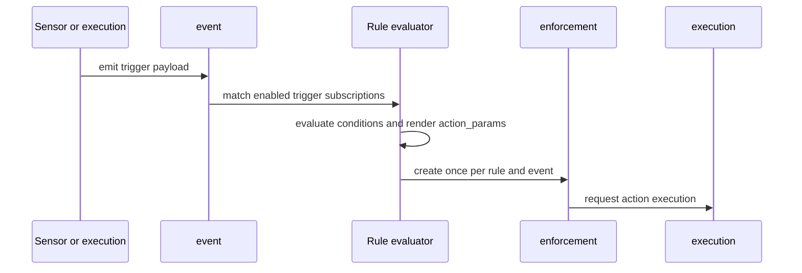

A rule connects one trigger to one action. It records the conditions under which an event matters and the templates that turn event data into the action's flat execution parameters. A match creates an enforcement, which gives the event-to-execution decision its own durable record.

## PostgreSQL representation

The `rule` table belongs to a pack and stores both numeric links and stable refs for its action and trigger. The foreign keys use `ON DELETE SET NULL`; `action_ref` and `trigger_ref` remain required. This keeps a deleted dependency identifiable without pretending that the rule can still run.

| Area | Meaningful columns |
| --- | --- |
| Endpoints | `action`, `action_ref`, `trigger`, `trigger_ref` |
| Match and rendering | `conditions`, `action_params`, `trigger_params` |
| Sensor placement | `sensor_worker_selector`, `sensor_worker_tolerations`, `sensor_worker_affinity` |
| Execution context | `trace_tag_template`, `permission_set_refs`, `owner_identity` |
| Lifecycle | `enabled`, `is_adhoc`, `created`, `updated` |

`conditions`, `action_params`, and `trigger_params` are JSONB. `action_params` is a flat map and produces a flat `execution.config`; it must never add a `parameters` wrapper. `trigger_params` is validated against the trigger's flat `param_schema`. Action values are validated against the action's flat `param_schema`. All Attune schemas use the flat per-field format, not raw JSON Schema.

`permission_set_refs` has three-state behavior. `NULL` inherits the target action's defaults, an empty array forces no execution token, and a non-empty array selects the named permission sets subject to delegation checks. `owner_identity` attributes rule-created executions to the identity that registered the rule; system-loaded rules can fall back to the system identity.

## Event-to-execution lifecycle

An event normally fans out to every enabled rule with the same trigger. Sensor or execution emission can target a specific positive numeric rule instance, which suppresses broadcast matching. Conditions may be empty, an expression over event context, or an array of supported comparisons. Templates use `event.payload.*`; `trigger.payload.*` is legacy.

The `enforcement` row snapshots `rule_ref`, `trigger_ref`, rendered config, payload, condition form, and status. A partial unique index on `(rule, event)` prevents duplicate enforcements while both IDs are present. Status starts at `created` and resolves to `processed` or `disabled`. `enforcement.event` is a plain `BIGINT`, because `event` is a TimescaleDB hypertable and cannot be a foreign-key target.

`trace_tag_template` can derive correlation from event, pack, and system context. Without one, the executor defaults rule-triggered work to `<trigger_ref>.<event_id>`. The resulting trace tag follows the enforcement and execution so the trace report can join activity across services.

## Ownership and lifecycle

The pack loader loads rules only after triggers and actions. File-backed rows have `is_adhoc = false`; API, CLI, and UI creation produces ad-hoc rows. Reload cleanup removes missing pack-managed rules but preserves ad-hoc rules. Create and update routes validate action and trigger reference visibility, both schemas, conditions, permissions, and sensor-worker placement.

Rule create, update, enable, disable, and delete operations publish lifecycle notifications for managed sensors. Sensors use those messages to update trigger instances without restarting when possible.

## Caveats

The numeric action or trigger link can be null while its ref remains. Reads and audit views can still describe such a rule, but execution requires the current referenced definitions.

Event, enforcement, and execution retention are independent. An enforcement can retain a plain event ID after event retention drops the corresponding hypertable row. Other operational records also keep plain execution or enforcement IDs so they can outlive those rows. Use denormalized refs and trace tags for durable identification rather than assuming every historical join succeeds.

Reference visibility is a pack-to-pack authoring rule. It does not replace RBAC checks on rule API operations or execution permissions.

See [Writing rules](/pack-development/rules/) and [Writing sensors](/pack-development/sensors/) for authoring and event contracts.

Implementation sources: [rule migration](https://github.com/attune-system/attune/blob/main/migrations/20250101000005_execution_and_operations.sql), [event and enforcement migration](https://github.com/attune-system/attune/blob/main/migrations/20250101000004_trigger_sensor_event_rule.sql), [rule placement migration](https://github.com/attune-system/attune/blob/main/migrations/20260902000003_sensor_workload_assignment.sql), [Rule model](https://github.com/attune-system/attune/blob/main/crates/common/src/models.rs), [rule repository](https://github.com/attune-system/attune/blob/main/crates/common/src/repositories/rule.rs), [rule API routes](https://github.com/attune-system/attune/blob/main/crates/api/src/routes/rules.rs), [rule lifecycle notifier](https://github.com/attune-system/attune/blob/main/crates/api/src/routes/rule_lifecycle_notifier.rs), and [rule web page](https://github.com/attune-system/attune/blob/main/web/src/pages/rules/RulesPage.tsx).
