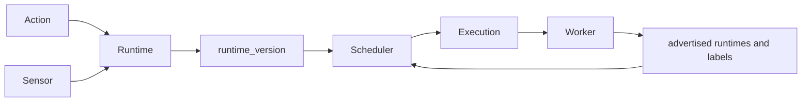

Runtimes describe how to launch code. Workers describe processes that can accept action or sensor work. Keeping these records separate lets an action request a runtime contract while the scheduler chooses a live worker that advertises compatible capabilities and satisfies placement rules.

## PostgreSQL representation

| Record | Purpose | Key state |
| --- | --- | --- |
| `runtime` | Named execution contract shared by actions and sensors | `name`, `aliases`, `distributions`, `installation`, `execution_config` |
| `runtime_version` | Concrete available version of one runtime | version components, full execution config, `is_default`, `available`, `verified_at` |
| `worker` | Live worker registration and operator state | type, role, capabilities, status, heartbeat, cordon fields |
| `worker_history` | Append-only field-change history | operation, changed fields, old and new values |

A runtime may belong to a pack, but `pack` and `pack_ref` are nullable to support auto-detected or system-managed definitions. `ref` is unique and lowercase. `aliases` are indexed as an array. `distributions`, `installation`, `installers`, `execution_config`, and `detection_config` are JSONB because runtime plugins have structured, runtime-specific settings.

`execution_config` describes interpreter invocation, optional isolated environments, dependency installation, inline execution, and environment adjustments. A native runtime uses an empty config and runs its entrypoint directly. A `runtime_version` stores a complete execution config rather than a patch over its parent. The unique key is `(runtime, version)`.

Worker rows have a unique `name`. `worker_type` is `local`, `remote`, or `container`; `worker_role` is `action` or `sensor`; and status is `active`, `inactive`, `busy`, or `error`. The optional `runtime` foreign key is a narrow relationship. Current scheduling reads supported runtimes and placement data from `capabilities`. It reads health from the typed `status`, `cordoned`, and `last_heartbeat` columns. Workers also report load for observability, but the scheduler does not use that value to rank or reject candidates.

## Selection and lifecycle

Pack loading upserts runtime definitions before actions and sensors. Runtime versions can come from a pack's `versions` list. Agents may also register detected runtimes with `auto_detected = true` and evidence in `detection_config`. Availability checks update version metadata separately from authored definitions.

Runtime names must be compared case-insensitively through `normalize_runtime_name()`. That normalization makes names such as `node`, `nodejs`, and `Node.js` resolve consistently. Actions and sensors may add semantic-version constraints. When matching version rows exist, execution selects the highest available matching version and uses that row's full execution configuration.

A worker registers on startup and updates `last_heartbeat`. The executor filters for the right role, supported runtime set, active and uncordoned state, fresh heartbeat, and effective placement. Exact selectors, required affinity, anti-affinity, taints, and tolerations filter candidates. Pack constraints combine with action or sensor constraints. A workflow task can override its target action's placement fields. The selected worker enforces local capacity with a semaphore and RabbitMQ backpressure after scheduling.

Observed health and operator intent are separate. `status` and `last_heartbeat` describe the worker's current service state. `cordoned`, `cordon_reason`, `cordoned_by`, and `cordoned_at` make an otherwise live worker unschedulable. The worker API exposes list and detail reads plus cordon and uncordon operations; workers own registration and heartbeat updates.

The history trigger records worker inserts, updates, and deletes in `worker_history`, a TimescaleDB hypertable. This history is important because heartbeat, status, capability, and cordon changes overwrite the current row.

## Caveats

Runtime JSONB is executable configuration, not descriptive metadata alone. Workers resolve templates such as `{pack_dir}`, `{env_dir}`, `{interpreter}`, `{action_file}`, and `{manifest_path}` when constructing a process.

`runtime_version.is_default` is documented as at most one row per runtime, but the base migration creates only a partial non-unique index. Selection code, not that index, carries the effective behavior. Do not assume the database rejects two defaults.

Deleting a runtime cascades to its versions and sensors. Action and worker references use weaker deletion behavior: actions have no explicit delete action on the runtime foreign key, while worker runtime links use `ON DELETE SET NULL`. Runtime deletion therefore needs service-level dependency checks.

See [Runtime authoring](/pack-development/runtime-authoring/), [runtime environments](/pack-development/runtime-environments/), and [standalone workers and sensors](/operations/standalone-workers-and-sensors/).

Implementation sources: [runtime migration](https://github.com/attune-system/attune/blob/main/migrations/20250101000002_pack_system.sql), [worker migration](https://github.com/attune-system/attune/blob/main/migrations/20250101000005_execution_and_operations.sql), [history migration](https://github.com/attune-system/attune/blob/main/migrations/20250101000009_timescaledb_history.sql), [runtime and worker models](https://github.com/attune-system/attune/blob/main/crates/common/src/models.rs), [runtime repository](https://github.com/attune-system/attune/blob/main/crates/common/src/repositories/runtime.rs), [runtime-version repository](https://github.com/attune-system/attune/blob/main/crates/common/src/repositories/runtime_version.rs), [runtime API routes](https://github.com/attune-system/attune/blob/main/crates/api/src/routes/runtimes.rs), [worker API routes](https://github.com/attune-system/attune/blob/main/crates/api/src/routes/workers.rs), and [runtime web page](https://github.com/attune-system/attune/blob/main/web/src/pages/runtimes/RuntimesPage.tsx).
