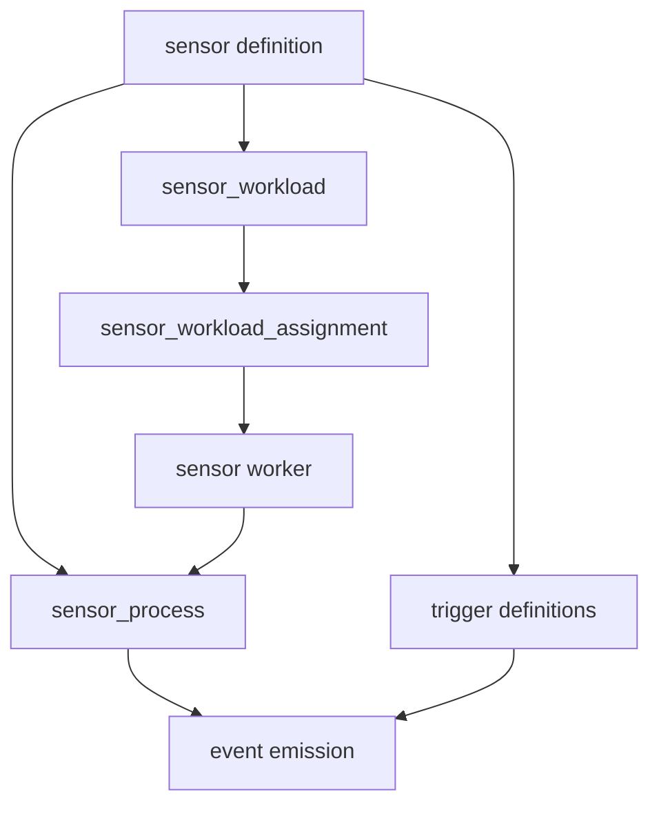

Sensors run long-lived code that watches an external system or schedule and emits events. The sensor definition says what to run. Separate records track each managed process and each durable unit of sensor work, because those states change independently of the authored definition.

## PostgreSQL representation

| Table | Role | Important columns |
| --- | --- | --- |
| `sensor` | Authored executable definition | entrypoint, runtime, version constraint, enabled, config, placement, retention |
| `trigger` | Event contracts emitted by a sensor | `sensor`, `sensor_ref`, schemas, enabled |
| `sensor_process` | Live managed-process state on one worker | status, PID, failures, restart time, log artifact, active rule count |
| `sensor_process_history` | Append-only changes to process state | operation, worker identity, changed fields, old and new values |
| `sensor_workload` | Stable work unit within a sensor | sensor, unique `workload_key` |
| `sensor_workload_assignment` | Fenced lease for a workload | worker, worker instance UUID, generation, lease times |

The `sensor` row may belong to a pack and always references a runtime. It stores both the runtime ID and `runtime_ref`, plus an optional semantic-version constraint. `entrypoint` names the script or binary. `worker_selector`, `worker_tolerations`, and `worker_affinity` are JSONB placement documents. Log and non-log artifact retention overrides are stored independently.

`param_schema` uses Attune's flat per-field schema format, not raw JSON Schema. It describes the sensor definition's parameter contract. The `config` column is nullable JSONB, but the current managed sensor path does not inject that document into the child process as a general configuration channel. Rule `trigger_params` and explicitly authorized data sources carry runtime settings instead.

## Process and workload lifecycle

Sensor workers have `worker_role = sensor`. Scheduling combines worker health, capacity, labels, taints, pack placement, sensor placement, and rule-level sensor placement. Exact selectors, required affinity, anti-affinity, and tolerations decide eligibility. Preferred affinity is stored but does not currently score sensor candidates.

A `sensor_process` row is unique for a sensor and worker pair. Status moves among `starting`, `running`, `stopped`, `failed`, and `backoff`. Failure fields support restart policy and alert escalation: consecutive failures, the last exit code or signal, next restart time, a bounded stderr excerpt, and the failure count last reported. `log_artifact_ref` connects process output to durable artifact storage. The history trigger copies each field-level change to a TimescaleDB hypertable.

Durable workload assignment handles restart and competing-worker races. A sensor can define multiple stable workload keys. Each assignment is either fully unowned or has a worker ID, worker-instance UUID, lease expiry, assignment time, and renewal time. `generation` only increases as ownership changes. Code that mutates an owned workload uses the worker identity, instance identity, and generation as a fence so a stale process cannot continue after losing its lease.

Enabled rules affect whether a sensor is needed and what instances it serves. Rule lifecycle changes are sent to compatible managed sensors through the notifier WebSocket. The process receives a startup snapshot plus the complete set of declared trigger refs, then updates its in-memory rule set without an ordinary restart.

## Ownership and deletion

Pack loading resolves runtimes and trigger refs before it loads sensors. Pack-managed sensors have `is_adhoc = false`; API-created sensors are ad hoc. Deleting a sensor cascades to its process rows and workloads. Trigger links use `ON DELETE SET NULL`, preserving trigger definitions that may have another ingress path. Deleting a worker cascades its `sensor_process` rows, while active workload assignments restrict worker deletion until ownership is cleared.

## Caveats

The definition's `enabled` flag, a process's status, and a workload lease answer different questions. A sensor can be enabled with no eligible worker, have a failed process while another workload remains leased, or retain history after the live process row disappears.

Sensor processes authenticate through sensor-specific tokens. Tokens, environment snapshots, stderr excerpts, and logs can contain sensitive operational context and must not be copied into public events or audit details.

See [Writing sensors](/pack-development/sensors/) and [standalone workers and sensors](/operations/standalone-workers-and-sensors/).

Implementation sources: [sensor migration](https://github.com/attune-system/attune/blob/main/migrations/20250101000004_trigger_sensor_event_rule.sql), [process migration](https://github.com/attune-system/attune/blob/main/migrations/20250101000005_execution_and_operations.sql), [workload-assignment migration](https://github.com/attune-system/attune/blob/main/migrations/20260902000003_sensor_workload_assignment.sql), [sensor models](https://github.com/attune-system/attune/blob/main/crates/common/src/models.rs), [sensor repository](https://github.com/attune-system/attune/blob/main/crates/common/src/repositories/trigger.rs), [process repository](https://github.com/attune-system/attune/blob/main/crates/common/src/repositories/sensor_process.rs), [workload repository](https://github.com/attune-system/attune/blob/main/crates/common/src/repositories/sensor_workload.rs), [sensor API routes](https://github.com/attune-system/attune/blob/main/crates/api/src/routes/triggers.rs), and [sensor web page](https://github.com/attune-system/attune/blob/main/web/src/pages/sensors/SensorsPage.tsx).
