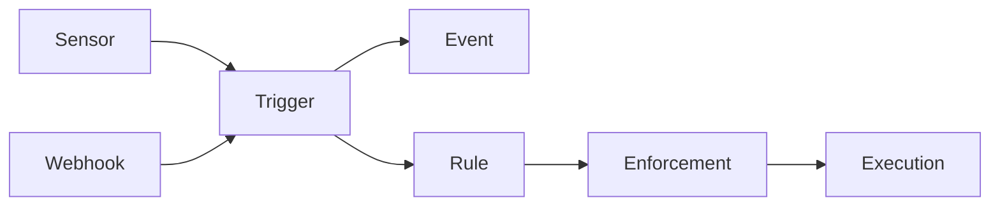

A trigger is an event-type definition. It names the event stream that rules subscribe to and describes both configuration accepted by a trigger instance and data emitted in an event payload. A trigger does not represent an occurrence. Each occurrence is an immutable `event` row.

## PostgreSQL representation

The `trigger` table stores a globally unique lowercase `<pack>.<name>` ref. Its pack relationship is optional, which permits ad-hoc records. Pack-loaded rows and API-created rows are distinguished by `is_adhoc`.

| Column group | Purpose |
| --- | --- |
| Contract | `param_schema`, `out_schema` |
| Activation | `enabled`, `is_adhoc` |
| Sensor link | `sensor`, `sensor_ref` |
| Webhook ingress | `webhook_enabled`, `webhook_key`, `webhook_config` |
| Cross-pack use | `reference_visibility`, `reference_allowed_pack_refs` |
| Ownership and identity | `pack`, `pack_ref`, `ref`, `label`, `description` |

`param_schema` and `out_schema` use Attune's flat per-field format, not raw JSON Schema. `param_schema` describes values associated with an instance, most often a rule's `trigger_params`. `out_schema` documents the emitted event payload. Current event and webhook ingestion stores payloads without validating them against `out_schema`.

The optional `sensor` foreign key points from a trigger to the sensor implementation that emits it and uses `ON DELETE SET NULL`. Webhook triggers need no sensor. A webhook-enabled row gets a unique generated key and JSONB security/configuration settings. `webhook_event_log` records request metadata, status, rate-limit decisions, and the resulting event ID without becoming part of the trigger definition itself.

## Relationships and flow

Sensors and webhook ingress both create events for a trigger ref. An event stores both nullable numeric links and denormalized `trigger_ref`, `source_ref`, and optional rule targeting data. The executor finds enabled rules that subscribe to the trigger, evaluates their conditions, and creates an enforcement for each matching rule and event pair.

Reference visibility controls which pack-owned rules may subscribe. `public` allows every pack. `private` allows only the trigger's owner pack. `restricted` also allows refs in `reference_allowed_pack_refs`. The allow-list must be empty unless visibility is `restricted`. API list queries combine this authored reference policy with the caller's RBAC read scope, so reference eligibility and row visibility remain separate checks.

The webhooks API enables or disables ingress and rotates webhook keys. The trigger API owns definition CRUD and explicit enable or disable operations. The web UI has list, create, detail, and edit routes under `/triggers`.

## Lifecycle and ownership

The pack loader creates or updates triggers before actions, rules, and sensors. It removes pack-managed triggers that disappear from the installed files but leaves ad-hoc rows alone. Deleting a pack cascades to its trigger definitions. Deleting a trigger sets nullable links in existing rules and events to null, while their denormalized refs remain.

Events are not child configuration records. Migration `20250101000009` converts `event` into a TimescaleDB hypertable partitioned by `created` and gives it a composite `(id, created)` primary key. Events are immutable after insertion. `enforcement.event` is a plain `BIGINT`, because TimescaleDB hypertables cannot be foreign-key targets, and may dangle after event retention.

## Caveats

The sensor relationship is one-directional in the schema: `trigger.sensor` points to `sensor`. The `sensor` row does not contain a trigger foreign key. Sensors that emit several trigger types are represented through multiple trigger rows or loader/runtime configuration rather than a join table.

`enabled` controls whether the trigger participates in normal use, but it does not erase prior events or webhook audit rows. A deleted or disabled definition can still be named by retained operational refs.

The webhook key is sensitive authentication material. Normal contributor tooling should avoid logging it or copying it into event payloads and audit details.

Do not rely on `out_schema` secret markers to redact ingested payload fields. Current ingestion checks `param_schema` when it separates protected values. Sensor and webhook authors must avoid putting secrets in event payloads unless the active ingestion contract protects them.

See [Writing sensors](/pack-development/sensors/) for trigger YAML and event emission, and [Writing rules](/pack-development/rules/) for subscriptions.

Implementation sources: [trigger and event migration](https://github.com/attune-system/attune/blob/main/migrations/20250101000004_trigger_sensor_event_rule.sql), [hypertable migration](https://github.com/attune-system/attune/blob/main/migrations/20250101000009_timescaledb_history.sql), [Trigger model](https://github.com/attune-system/attune/blob/main/crates/common/src/models.rs), [trigger repository](https://github.com/attune-system/attune/blob/main/crates/common/src/repositories/trigger.rs), [trigger API routes](https://github.com/attune-system/attune/blob/main/crates/api/src/routes/triggers.rs), [webhook routes](https://github.com/attune-system/attune/blob/main/crates/api/src/routes/webhooks.rs), and [trigger web page](https://github.com/attune-system/attune/blob/main/web/src/pages/triggers/TriggersPage.tsx).
