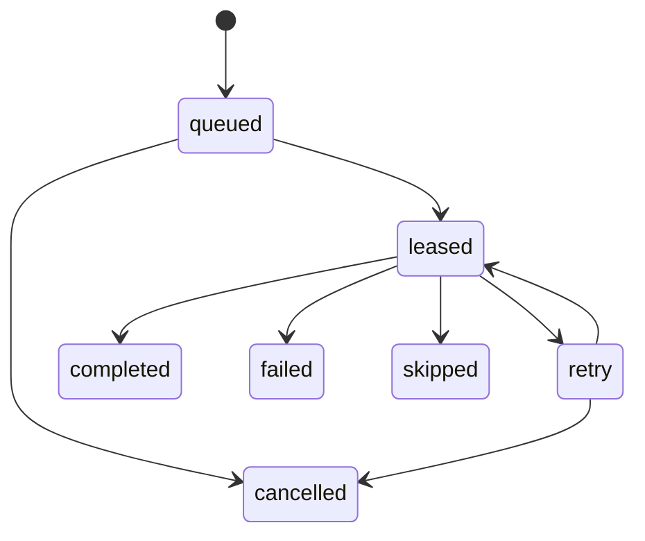

Work queues hold user-visible business work until an action can process it. They are durable application data, not transport plumbing. This distinction matters because Attune also uses RabbitMQ queues to move internal service messages. A `work_queue_item` survives executor restarts in PostgreSQL; a RabbitMQ message tells a service that persisted state needs attention.

See [Manage work queues](/administration/queues/) for operator-facing configuration. See [RabbitMQ architecture](/internal-implementation/supporting-systems/rabbitmq/) for the broker topology.

## Representation

The [work queue migration](https://github.com/attune-system/attune/blob/main/migrations/20250101000012_work_queues.sql) creates three tables. Rust maps them to `WorkQueue`, `WorkQueueItem`, and `WorkQueueDispatch` in the [common models](https://github.com/attune-system/attune/blob/main/crates/common/src/models.rs#L2022-L2107).

| Table | Role | Important fields |
| --- | --- | --- |
| `work_queue` | Queue definition and dispatch policy | `ref`, owner pack, enable and intake flags, action ref, priority, schemas, batch mode, permissions, `config` |
| `work_queue_item` | One durable unit of business work | payload, metadata, priority, status, provenance, lease, attempts, acknowledgement |
| `work_queue_dispatch` | Lineage between a lease and its processing execution | queue, execution ID, dispatch status, leased item count |

A queue can come from a pack or from the API and UI. `is_adhoc` distinguishes API-managed definitions from declarative pack definitions. `pack_ref`, `dispatch_action_ref`, and `queue_ref` preserve useful names when nullable numeric relationships change. The `execution`, `requested_by_execution`, `requested_by_enforcement`, and `leased_execution` columns are plain `BIGINT` values so queue lineage can survive independent retention of execution and enforcement rows.

`item_schema` is Attune's flat per-field schema. The repository validates it on definition writes, and the API validates payloads before enqueue or pending-item updates. `action_params` contains templates that the executor resolves against queue, item, pack configuration, and related context. `config` stores typed dispatch settings such as concurrency, batch size, retry limit, coalescing, delay, and acknowledgement version. The concrete Rust shape is `WorkQueueConfig` in the [work queue models](https://github.com/attune-system/attune/blob/main/crates/common/src/models.rs#L2109-L2186).

## Item and dispatch lifecycle

Items start as `queued`. The executor also treats `retry` as ready. Leasing changes selected rows to `leased`, assigns a UUID lease token and expiry, records the processing execution, and increments `attempt_count`. Selection orders by priority descending, then creation time and ID ascending. Batch coalescing can narrow a batch further. The repository uses row locking to keep concurrent dispatchers from taking the same rows; see [`lease_next_batch`](https://github.com/attune-system/attune/blob/main/crates/common/src/repositories/work_queue.rs#L1514).

The [queue dispatcher](https://github.com/attune-system/attune/blob/main/crates/executor/src/queue_dispatcher.rs) polls enabled definitions, resolves tunables and templates, leases one item or a batch, and creates a normal `execution`. It also inserts a `work_queue_dispatch` row. Only then does it publish `ExecutionRequested` through RabbitMQ. The execution follows the ordinary scheduler and worker path.

The action returns `execution.result.queue_ack`. On completion, the [completion listener](https://github.com/attune-system/attune/blob/main/crates/executor/src/completion_listener.rs#L345-L529) checks the acknowledgement version and exact leased item IDs. It applies each requested terminal state, or returns an item to `retry` while the retry limit allows it. Missing, malformed, or mismatched acknowledgements fail the dispatch and retry or fail its items. This contract prevents a successful process exit from silently losing leased work.

Expired leases support crash recovery. Dispatch rows have their own states, `leased`, `dispatched`, `completed`, `failed`, `released`, and `cancelled`, so contributors can inspect lineage separately from item outcomes.

## Enqueue and ownership

`enabled` controls executor dispatch. `accepting_new_items` controls intake. They are independent, which permits draining a queue without accepting more work.

An optional `item_key` supports updates to pending `queued` or `retry` items. If `allow_pending_update` is false, a new item is inserted. If it is true, `immutable`, `replace`, or `merge_patch` determines collision behavior. The API performs the operation in a transaction; see [`enqueue_queue_item_in_transaction`](https://github.com/attune-system/attune/blob/main/crates/api/src/routes/work_queues.rs#L1154-L1284).

Deleting a `work_queue` cascades to its items and dispatch records. Pack registration removes declarative queues no longer present in the pack, while ad hoc queues are not part of that cleanup. Queue and item changes also emit PostgreSQL notifications for UI updates. Those notifications do not drive dispatch.

## Authorization

Every public route uses `RequireAuth`. Definition operations check the `queues` RBAC resource. Item operations check `queue_items`, with constraints against the queue ID, ref, or owning pack. `reference_visibility` controls whether other packs may target a pack-owned queue: `public`, `private`, or `restricted` with `reference_allowed_pack_refs`. It does not replace RBAC for direct API calls.

`permission_set_refs` controls the execution token created for dispatched work. `NULL` inherits the dispatch action's defaults, an empty array creates no execution API token, and a non-empty array selects exact permission sets. API callers may configure only permission sets they can delegate. The [queue routes](https://github.com/attune-system/attune/blob/main/crates/api/src/routes/work_queues.rs#L263-L341) enforce that check.

## Caveats

- Work queue priority is not RabbitMQ priority. PostgreSQL selection decides item order before RabbitMQ receives an execution request.
- Queue deletion removes business items and lineage through cascading foreign keys. Disable intake or dispatch when preservation matters.
- Trace tags can originate on an item, come from `trace_tag_template`, or use the queue-and-item or queue-and-dispatch default. They correlate records but do not define ownership.
- `queue_stats` and execution admission tables describe action concurrency. They are separate from these user-visible work queues.
