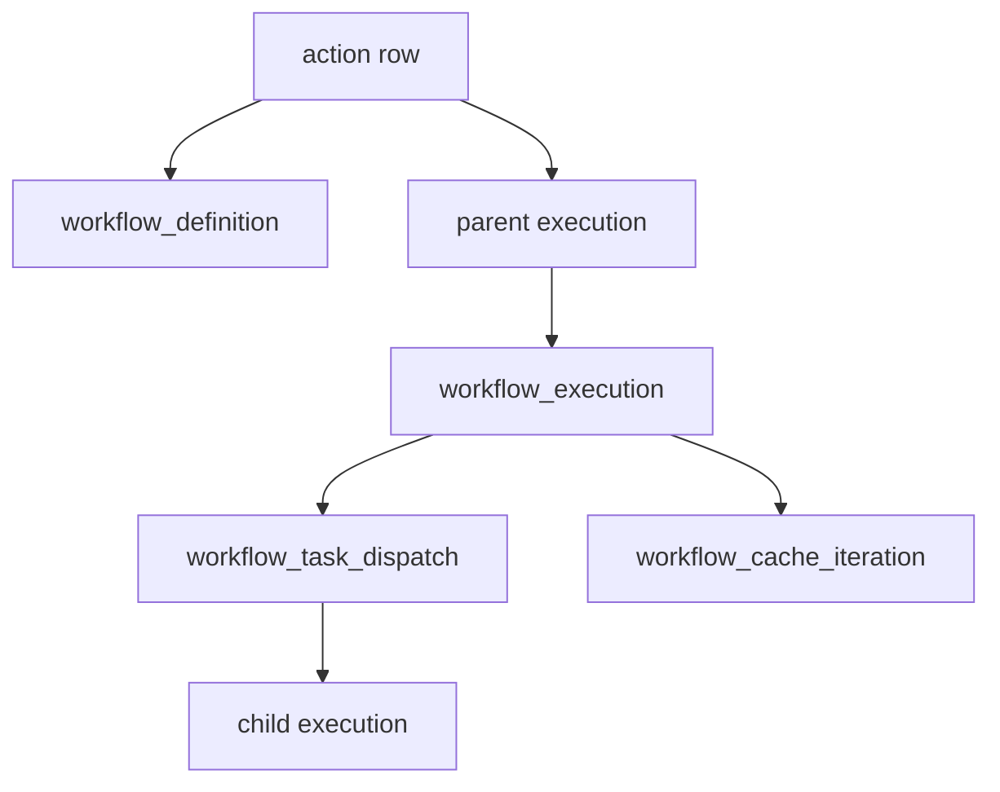

A workflow composes actions into a directed task graph. It is still invoked as an action: callers execute the companion `action` row, and the executor recognizes its non-null `workflow_def` link. This split keeps the callable interface with actions while giving orchestration state its own records.

## Two-file authoring invariant

Workflow actions are stored as two files. Action metadata lives in `actions/<name>.yaml`. The graph lives in `actions/workflows/<name>.workflow.yaml`. The action YAML links the graph with `workflow_file`; the graph must not be embedded in the action YAML.

The action file owns `ref`, `label`, `description`, `parameters`, `output`, tags, permission defaults, reference visibility, and placement defaults. The graph file owns `version`, `vars`, `tasks`, `next` transitions, `output_map`, and `cancellation_policy`. Tasks are action invocations. The canonical transition model is `next: []`, with conditions on transitions rather than tasks.

All `param_schema` and `out_schema` values persisted for the workflow use Attune's flat per-field schema format, not raw JSON Schema. A pure `{{ ... }}` workflow expression preserves its JSON type. Task input and the parent execution's `config` are flat parameter maps, never objects wrapped under `parameters`.

## PostgreSQL representation

| Table or link | Purpose |
| --- | --- |
| `action.workflow_def` | Marks an action as a workflow and links its callable interface to the graph |
| `workflow_definition` | Stores pack ownership, interface copies, version, tags, and the parsed graph in `definition` JSONB |
| `workflow_execution` | Stores mutable state for one parent execution |
| `workflow_task_dispatch` | Deduplicates ownership of each task and optional item index before linking a child execution |
| `workflow_cache_iteration` | Checkpoints native iteration over a pinned cache generation |
| `execution.parent` and `execution.workflow_task` | Relate normal execution rows to the workflow and task that created them |

`workflow_definition.definition` is the YAML graph parsed to JSONB. `workflow_execution` has a one-to-one unique link to its parent `execution`. It records current, completed, failed, and skipped task-name arrays; mutable published `variables`; the runtime `task_graph`; status; pause state; and an error message.

Each workflow task runs as a normal child execution. `workflow_task_dispatch` has a unique identity over workflow execution, task name, and `COALESCE(task_index, -1)`. That record prevents duplicate dispatch when the executor retries orchestration work. Cache iteration adds a durable cursor, counts, batch and concurrency settings, and a terminal state without first loading an entire cache generation into workflow context.

## Lifecycle and ownership

The pack loader parses the two files, upserts the definition, creates or updates the companion action, and links `action.workflow_def`. The workflow file API writes both files and synchronizes both database records for the visual builder. The generic workflow API also creates a companion action, although its database request represents the definition directly.

At run time, the executor creates the parent execution and workflow state, evaluates ready tasks, and creates child executions. Child completion updates task state, publishes transition variables, and may make more tasks ready. Pause, cancellation, retry, item expansion, and cache iteration remain executor concerns; workers only run the resulting action executions.

Deleting a `workflow_definition` cascades to `workflow_execution` and its dispatch records. The `action.workflow_def` foreign key also uses `ON DELETE CASCADE`, so the companion action is deleted. Deleting the parent execution removes its workflow state. Child executions are ordinary execution records and carry lineage independently.

## Caveats

`workflow_definition` repeats the action's label, description, parameter schema, output schema, and tags. File-based authoring treats the action YAML as authoritative for those interface fields, so code that updates only one row can create drift.

The graph and mutable execution state are JSONB rather than normalized task tables. Repository code must deserialize and validate those shapes before use. The `workflow_execution` arrays are summaries of task names; child execution rows and dispatch records hold per-attempt and per-item detail.

See [Writing workflows](/pack-development/workflows/) and [cache iteration](/pack-development/cache-iteration/) for the authoring contract.

Implementation sources: [workflow migration](https://github.com/attune-system/attune/blob/main/migrations/20250101000006_workflow_system.sql), [cache-iteration migration](https://github.com/attune-system/attune/blob/main/migrations/20250101000023_workflow_cache_iteration.sql), [workflow models](https://github.com/attune-system/attune/blob/main/crates/common/src/models.rs), [workflow repository](https://github.com/attune-system/attune/blob/main/crates/common/src/repositories/workflow.rs), [workflow parser](https://github.com/attune-system/attune/blob/main/crates/common/src/workflow/parser.rs), [workflow API routes](https://github.com/attune-system/attune/blob/main/crates/api/src/routes/workflows.rs), and [workflow builder](https://github.com/attune-system/attune/blob/main/web/src/pages/actions/WorkflowBuilderPage.tsx).
