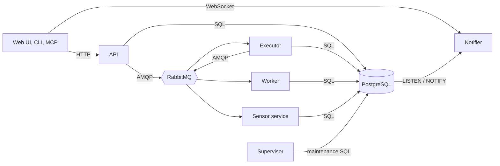

This section explains Attune's implementation contracts. It is for contributors, integration authors, and operators who need to understand persisted state, process ownership, or internal delivery paths.

Use the existing Administration, Pack development, Operations, and Reference sections for task instructions. The pages here describe what exists and how the pieces interact.

## Platform map



PostgreSQL holds authoritative platform state. RabbitMQ delivers asynchronous work and lifecycle signals. The notifier turns PostgreSQL notifications into permission-checked WebSocket updates.

## Browse by angle

| Section | Use it to understand |
| --- | --- |
| [Data structures](/internal-implementation/data-structures/) | Resource intent, database representation, major relationships, lifecycle, and sharp edges |
| [Services and processes](/internal-implementation/services/) | Process boundaries, components, dependencies, recovery behavior, and the supporting Notifier WebSocket and RabbitMQ contracts |

## Follow an automation run

The main event path is:

```text
Sensor -> Trigger -> Event -> Rule -> Enforcement -> Execution -> Artifact
```

Start with [Sensors](/internal-implementation/data-structures/sensors/) for externally observed input, or [Executions](/internal-implementation/data-structures/executions/) for scheduled work. [Workflows](/internal-implementation/data-structures/workflows/) and [Work queues](/internal-implementation/data-structures/work-queues/) create specialized execution lineages while preserving the same worker execution path.

## Process boundary

The core platform has six long-running service families: API, executor, worker, sensor, notifier, and supervisor. `attune-agent` and `attune-sensor-agent` are deployment variants of worker and sensor. `attune-mcp` can also run as a persistent integration process, so it has a page beside the core services.
