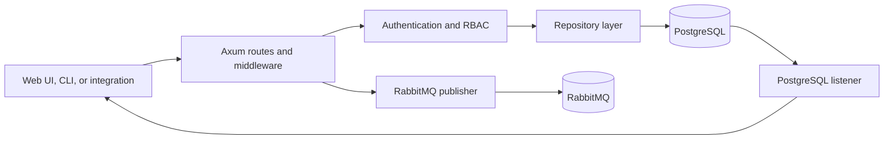

The API is Attune's authenticated HTTP control plane. It owns client-facing resource operations and records intent before other services perform asynchronous work.

## Responsibilities

The `attune-api` binary exposes root authentication routes, health checks, OpenAPI documentation, and versioned routes under `/api/v1`. Those routes cover packs, actions, runtimes, rules, triggers, events, executions, inquiries, keys, permissions, workers, workflows, work queues, artifacts, caches, retention configuration, audit data, and dashboard reads. The route inventory lives in [`server.rs`](https://github.com/attune-system/attune/blob/main/crates/api/src/server.rs) and [`routes/mod.rs`](https://github.com/attune-system/attune/blob/main/crates/api/src/routes/mod.rs).

The API also owns authentication and request authorization. Axum extractors and middleware validate JWTs, while route handlers use the authorization service for RBAC and resource visibility. Request middleware applies CORS, tracing, request logging, and audit capture. Pack upload and registration paths coordinate database metadata with pack files. Artifact routes expose metadata from PostgreSQL and file content through the configured artifact transport.

## Internal mechanisms

`main.rs` loads and validates shared configuration, opens the database pool, starts the asynchronous audit writer, and creates `AppState`. That state holds the pool, JWT settings, CORS origins, a replaceable RabbitMQ publisher, an SSE broadcast sender, and the audit emitter. The Axum server then merges the route modules into one router.

Two background PostgreSQL tasks run beside HTTP handling. One listens for database notifications and forwards selected changes to Server-Sent Events. The other checks inquiry timeouts. A separate cleanup loop marks stale pack installs failed and removes abandoned pack staging directories. These jobs are API-owned because they support API request state, not general platform maintenance. See [`main.rs`](https://github.com/attune-system/attune/blob/main/crates/api/src/main.rs) and [`state.rs`](https://github.com/attune-system/attune/blob/main/crates/api/src/state.rs).

Most handlers follow a persist-then-publish pattern. For example, manual action execution validates and encrypts secret parameters, inserts an `execution` in `requested` state through `ExecutionRepository`, and publishes `ExecutionRequested`. Event ingestion inserts the event and its protected values in a transaction, commits, then publishes `EventCreated`. PostgreSQL is authoritative; RabbitMQ messages carry IDs that consumers use to reload current rows.

## Inbound and outbound interfaces

Inbound traffic is HTTP. Normal clients use JSON REST endpoints, file routes use multipart or streaming bodies where required, and execution views can use SSE for live invalidation. Webhooks are also API routes, but they authenticate and normalize external requests before creating events. The API does not host the notifier WebSocket endpoint.

Outbound interfaces are PostgreSQL queries through repositories, artifact and pack filesystem access, and RabbitMQ publications. The API publishes execution requests, event creation, inquiry responses, rule and pack lifecycle changes, worker cancellation, pack test requests, and metadata invalidations. Each API replica also consumes permission and identity authorization changes through a broker-named ephemeral queue so it can invalidate local authorization metadata.

## PostgreSQL and RabbitMQ

PostgreSQL stores every durable API resource and the audit trail. Database triggers also emit notifications used by SSE and by the separate notifier service. The API writes through repositories rather than embedding service-level SQL.

RabbitMQ is optional in shared configuration, but several mutations need it to reach another service. Startup creates a confirmed publisher against `attune.executions` and retries connection with bounded backoff. The active shared topology still comes from `attune_common::mq::MessageQueueConfig::default()`, not from custom exchange names in YAML. The current queue details are documented in [`internal-message-queues.md`](https://github.com/attune-system/attune/blob/main/docs/architecture/internal-message-queues.md).

## Failure and recovery

The API can start without RabbitMQ. It logs that executions cannot be queued, keeps the publisher empty, and continues serving routes. Publication behavior then depends on the handler. Event creation tolerates a missing or failed publisher after committing the row. Manual execution also commits first, but a publish failure returns an HTTP error. Either case can leave durable state without its wake-up message. The supervisor can republish stale requested executions, but there is no general transactional outbox for every message type.

The publisher reconnect loop restores a publisher after startup failure. Recovery after a persistent broker failure later in the process is incomplete: `AppState` has no path that clears a failed shared publisher, so the reconnect loop continues to see the original value. The publisher itself attempts one channel reset for errors it classifies as recoverable. PostgreSQL startup failure is fatal. Ctrl+C stops the server selection loop, but the Axum startup path does not call the otherwise defined `Server::shutdown()` cleanup method.

## Deployment variants

[`Cargo.toml`](https://github.com/attune-system/attune/blob/main/crates/api/Cargo.toml) defines the `attune-api` binary and a library used by integration tests. Docker Compose builds the `api` target from `docker/Dockerfile.optimized`, exposes port 8080, and mounts pack, runtime-environment, artifact, agent-binary, and configuration volumes. The same binary can run directly from Cargo or a packaged service; configuration loading remains shared.

## Caveats

- The API records intent but does not schedule or run actions.
- PostgreSQL commits and RabbitMQ publications are not atomic.
- `/docs` and `/api-spec/openapi.json` come from the compiled OpenAPI document; route changes must keep that document aligned.
- Configuring `agent.binary_dir` without `agent.bootstrap_token` makes startup fail closed.
- The API's SSE stream and the notifier's WebSocket stream are separate implementations.
