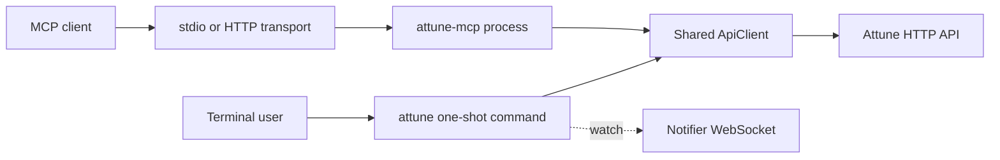

The `attune-cli` crate builds two client programs. `attune` runs one terminal command and exits. `attune-mcp` stays alive and translates MCP JSON-RPC tool calls into Attune API requests.

## One-shot CLI

[`src/main.rs`](https://github.com/attune-system/attune/blob/main/crates/cli/src/main.rs) parses a Clap command, resolves output format, dispatches to a command module, prints the result, and exits nonzero on error. Commands cover authentication, configuration, packs, actions, workflows, rules, triggers, sensors, executions, queues, policies, keys, caches, artifacts, and audit data. `attune run` is a short route to action execution. Watch modes may combine API polling or notifier WebSocket updates with a command, but no daemon remains after the command finishes.

Named profiles live in the user's config directory and hold an API URL, access token, refresh token, and login metadata. Explicit command flags override profile choices. The shared [`ApiClient`](https://github.com/attune-system/attune/blob/main/crates/cli/src/client.rs) adds bearer authentication, prefixes resource paths with `/api/v1`, refreshes once after a 401 when a refresh token exists, and parses standard or paginated response envelopes. Shell completion uses a read-only config path so pressing Tab does not create a default config file.

## Persistent MCP server

[`attune-mcp.rs`](https://github.com/attune-system/attune/blob/main/crates/cli/src/bin/attune-mcp.rs) implements a curated MCP tool server. It exposes action, execution, trace, inquiry, queue, workflow, pack, artifact, event, and cache operations. It deliberately omits direct event creation because the API restricts event emission to sensor and execution token flows.

The default stdio transport reads framed JSON-RPC messages from stdin and writes responses to stdout for the lifetime of the parent MCP client. HTTP mode starts an Axum server with `POST /mcp` and `GET /health` on the configured address. It is a persistent service transport, but it is not a general replacement for the Attune API. The HTTP handler serializes access to one `McpServer` with a mutex, including its small in-memory cache-refresh metadata set.

Initial authentication precedence is execution token, explicit access token, profile token, startup login when the profile has no token, then anonymous access. The underlying API client first attempts refresh-token recovery after an authentication failure. If refresh and the current token both fail, startup-login mode can repeat the login and retry one failed tool call. Execution-token mode never stores login credentials for that fallback.

`packs_check` is the one tool that reads the MCP host filesystem rather than calling the API. Stdio mode allows local paths. HTTP mode disables the tool unless the process starts with allowlisted roots, because a remote client path names the server's filesystem.

## Process and data boundaries

Neither binary opens PostgreSQL or RabbitMQ. Both use the public HTTP API and inherit its authorization and publication behavior. The CLI can connect to the notifier for watched execution output; MCP tool calls currently use request-response API operations rather than a notifier subscription.

[`Cargo.toml`](https://github.com/attune-system/attune/blob/main/crates/cli/Cargo.toml) defines both targets. Docker Compose does not run the one-shot CLI as a service. It offers an optional `mcp` profile that runs HTTP transport on port 8090 and depends on the API health check. The agent initialization image also places both binaries in the shared agent volume.

## Failure behavior and caveats

CLI failures print one error and set exit status 1. MCP converts tool failures into MCP error results while keeping the server alive. Invalid JSON-RPC methods receive method-not-found responses. HTTP mode currently has no transport-level authentication of its own; Attune credentials configure the server-side API client, so deployment access control must treat that listener as trusted.

Profile tokens are stored in the CLI YAML file. `ATTUNE_API_TOKEN`, `ATTUNE_AUTH_TOKEN`, and explicit MCP flags can override them. The stdio and HTTP transports share tool semantics but not filesystem trust: a path validated by `packs_check` always belongs to the machine that runs `attune-mcp`.
