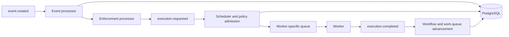

The executor is Attune's orchestration process. It evaluates persisted event and rule state, admits work, selects workers, and advances workflows after action completion.

## Responsibilities

`attune-executor` owns orchestration between durable intent and worker handoff. It consumes new events, creates matching enforcements, turns enforcements into requested executions, applies admission and concurrency policies, and schedules compatible workers. It also advances workflows, dispatches database-backed work queues, handles inquiry responses, routes pack tests, watches execution timeouts, and reconciles worker heartbeat loss.

This boundary matters. The API creates manual executions and events. Workers own action process execution and terminal action state after dispatch. The executor coordinates both sides and reads PostgreSQL before acting on messages.

## Internal mechanisms

[`ExecutorService::start`](https://github.com/attune-system/attune/blob/main/crates/executor/src/service.rs) starts independent Tokio tasks for `EventProcessor`, `EnforcementProcessor`, `ExecutionScheduler`, `ExecutionManager`, `CompletionListener`, `InquiryHandler`, `PackTestProcessor`, the timeout checker, the worker heartbeat monitor, the work-queue dispatcher, metadata invalidation, and the dead-letter handler when enabled.

The event path reloads an event by ID, finds matching enabled rules, evaluates conditions, creates enforcements, and publishes `EnforcementCreated`. The enforcement path reloads the enforcement and rule, creates an execution, applies policy admission, and publishes `ExecutionRequested` when the execution may proceed. The scheduler reloads the execution and action, evaluates runtime and worker-placement constraints, selects an active compatible worker, records scheduling state, and publishes to that worker's routing key.

Completion is a separate path. Workers publish status changes for lifecycle observation and `ExecutionCompleted` for downstream accounting. `CompletionListener` reloads execution state, releases policy and work-queue capacity, and advances workflow tasks. Workflow graphs, transition conditions, retries, item iteration, cache iteration, and inquiry waits all remain executor concerns. The scheduler keeps bounded action metadata caches, while per-replica ephemeral metadata messages invalidate changed actions.

## Inbound and outbound interfaces

The executor has no public HTTP server. Its inbound interface is RabbitMQ plus periodic PostgreSQL scans. Fixed durable queues carry events, enforcements, execution requests, status changes, completions, inquiry responses, and pack tests. A broker-named ephemeral queue carries action metadata invalidations. Timers drive inquiry timeout checks, worker heartbeat checks, scheduled-execution timeout checks, and work-queue dispatch.

Outbound messages include enforcements, execution requests, targeted worker dispatches, targeted cancellations, completion notifications for synthetic terminal states, pack-test dispatches, inquiries, and system alerts. PostgreSQL writes expose the resulting state to the API and notifier.

## PostgreSQL and RabbitMQ

PostgreSQL is the source of truth for events, rules, enforcements, executions, workers, policies, workflow state, inquiries, and work queues. Message payloads identify work, but processors reload rows and check persisted status. This makes many duplicate or stale deliveries harmless. Repository methods own all database access.

The executor declares the fixed queues it consumes and uses publisher confirms. Most consumers use manual acknowledgements and prefetch 10. Multiple executor replicas compete on the same durable queues, which is why database state checks and conditional updates matter. The full active topology and payload mismatches are recorded in [`internal-message-queues.md`](https://github.com/attune-system/attune/blob/main/docs/architecture/internal-message-queues.md).

## Failure and recovery

Database or RabbitMQ connection failure during `ExecutorService::new` prevents startup. Consumer infrastructure reconnects after recoverable broker failures and restores QoS. Handler errors classified as transient are nacked and requeued; invalid payloads and other non-retriable failures are nacked without requeue. There is no delayed retry queue or broker-enforced retry limit.

The executor marks workers inactive after stale heartbeats and emits `core.alert` for unexpected loss. Timeout monitoring handles executions left in `scheduled`. The supervisor provides a slower safety net for stale requested, scheduling, scheduled, running, workflow, admission, and queue state.

The dead-letter path has a known defect: `attune.dlx` is a direct exchange, but its queue binds the literal key `#`. Normal dead-letter routing keys do not match, so contributors must not assume the `DeadLetterHandler` receives expired worker dispatches.

## Deployment variants

[`Cargo.toml`](https://github.com/attune-system/attune/blob/main/crates/executor/Cargo.toml) defines the `attune-executor` binary and testable library. Docker Compose deliberately runs `executor` and `executor-2` against the same PostgreSQL and RabbitMQ services. Both mount packs and artifacts. Direct Cargo and packaged deployments run the same process model.

## Caveats

- Worker state ownership changes at targeted dispatch. The executor owns pre-dispatch transitions; the worker owns action state after receiving work.
- Fixed-queue replicas compete for messages. Replica-local metadata invalidation uses a separate ephemeral queue per replica.
- The executor is not an HTTP API and does not execute pack code.
- YAML queue names do not currently replace the shared Rust topology defaults.
- Workflow completion depends on `execution.completed`, not only on a terminal database row.
