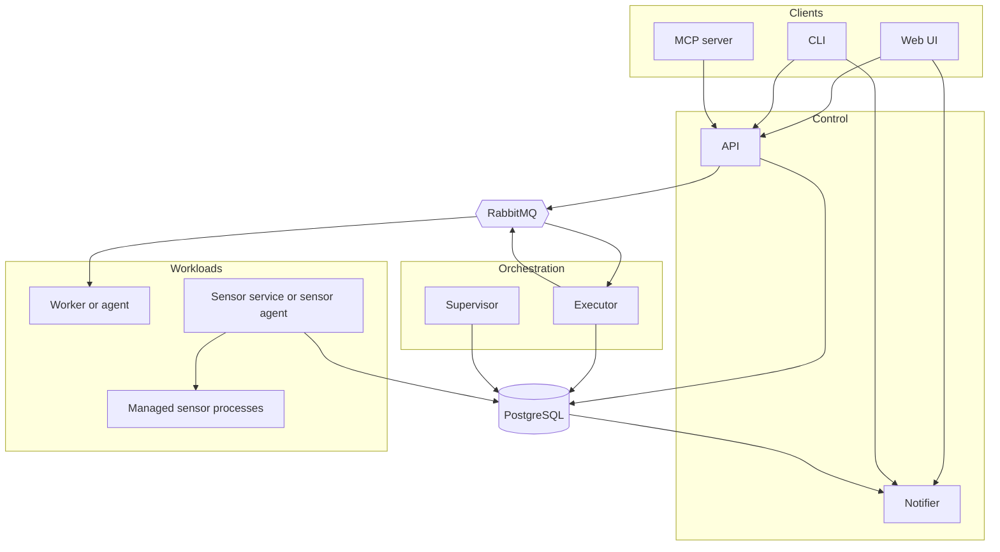

Attune separates client-facing control, orchestration, execution, sensor supervision, live updates, and maintenance into independently runnable processes.

## Responsibility map

| Concern | Primary owner | Other participants |
| --- | --- | --- |
| HTTP resources, authentication, and RBAC | API | PostgreSQL and RabbitMQ |
| Rule evaluation and execution scheduling | Executor | API and sensors publish inputs |
| Action processes and terminal action state | Worker | Executor dispatches and consumes completion |
| Managed sensor processes | Sensor service | API, notifier, and pack sensor binaries |
| Live client updates | Notifier | PostgreSQL trigger publishers |
| Retention and stale-state repair | Supervisor | RabbitMQ wakeups where available |
| Terminal and agent integrations | CLI and MCP | API and notifier |

## Deployment map

The worker and sensor agent binaries change bootstrap and runtime discovery, not service ownership. Managed sensor binaries are child processes owned by the sensor service rather than additional platform services.
