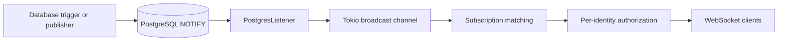

The notifier is a best-effort live-update bridge. It converts PostgreSQL `LISTEN/NOTIFY` payloads into authorized WebSocket messages without becoming a second source of resource state.

## Responsibilities

`attune-notifier` listens to a fixed set of PostgreSQL channels, parses their common routing fields, fans notifications into process memory, matches client subscriptions, checks entity visibility, and writes WebSocket text frames. It also exposes lightweight `/health` and `/stats` HTTP endpoints.

This page explains the process boundary. The detailed handshake, filters, message catalog, and payload contract belong in the [notifier WebSocket reference](/internal-implementation/supporting-systems/notifier-websocket/).

## Internal mechanisms

[`NotifierService`](https://github.com/attune-system/attune/blob/main/crates/notifier/src/service.rs) creates a 1,000-item Tokio broadcast channel, a `SubscriberManager`, a dedicated `PostgresListener`, a small PostgreSQL query pool capped at four connections, and the Axum WebSocket server. Three long-running tasks handle database receipt, authorization-aware fan-out, and HTTP connections. If any task ends, `start()` reports that the component stopped unexpectedly.

`PostgresListener` creates one dedicated `PgListener` and calls `listen_all()` once with the complete channel list. This is a correctness requirement. Repeated `listen()` calls in a loop can leave channels unsubscribed. Each payload must be JSON with string `entity_type` and numeric `entity_id`; malformed payloads are logged and discarded. The PostgreSQL channel name becomes `notification_type`.

The subscriber manager first narrows delivery to matching connections. Dispatch then groups connections by authorization snapshot and checks the referenced entity in PostgreSQL once for each identity snapshot. The connection captures roles, grants, identity attributes, token type, and expiry at connect time. A periodic check closes expired-token connections, but later permission changes do not rewrite an existing snapshot.

## Inbound and outbound interfaces

Inbound database channels cover execution creation and status, inquiries, enforcements, events, workflow execution state, artifacts, work queues and items, and rule lifecycle. Database triggers produce most of these messages. The notifier accepts WebSocket upgrades at `/ws`; clients authenticate with a bearer header or the browser-compatible JWT subprotocol. Query-string tokens are rejected.

Outbound traffic is WebSocket text. Clients use it as a signal to update or refetch API data. `/health` returns process health and `/stats` reports current connection and subscription counts. The notifier does not expose resource CRUD and does not persist client subscriptions.

## PostgreSQL and RabbitMQ

PostgreSQL supplies both notification transport and authorization data. The dedicated listener connection receives `NOTIFY`; the small pool handles role and visibility queries. The API remains the authority for current entity data.

The notifier has no active RabbitMQ interaction. `attune.notifications` and its queue remain dormant shared topology. Docker Compose still supplies a message queue URL and waits for RabbitMQ, but the notifier source does not open an AMQP connection. Contributors should not route live UI behavior through that dormant exchange. See [`postgres_listener.rs`](https://github.com/attune-system/attune/blob/main/crates/notifier/src/postgres_listener.rs) and [`queue-ownership.md`](https://github.com/attune-system/attune/blob/main/docs/architecture/queue-ownership.md).

## Failure and recovery

PostgreSQL does not retain notifications for disconnected listeners, and the notifier does not add persistence, acknowledgements, or replay. A client that reconnects must restore subscriptions and fetch current state from the API. The in-process channel also drops messages when a receiver falls behind and logs the count. These properties make the stream suitable for invalidation, not durable work.

On a listener receive error, `PostgresListener` pauses, creates a new listener, and subscribes to all channels again. Invalid payloads do not stop the receive loop. A failed WebSocket send affects that connection rather than database state. Graceful shutdown broadcasts a stop signal and disconnects subscribers.

Large database payloads may arrive in compact `auth_mode: "deferred"` form. The routing core remains, but omitted fields require an API fetch. This avoids PostgreSQL's notification payload limit without pretending that the WebSocket message is complete state.

## Deployment variants

[`Cargo.toml`](https://github.com/attune-system/attune/blob/main/crates/notifier/Cargo.toml) defines one `attune-notifier` binary. Docker Compose builds the notifier service, exposes port 8081, mounts configuration and logs, and uses `/health` for its container health check. The same binary can run from Cargo or a service package. Multiple replicas can each listen to PostgreSQL, but connections and subscriptions remain replica-local.

## Caveats

- Delivery is best effort and has no replay.
- Authorization changes require clients to reconnect for a new snapshot.
- Notification payloads are hints; fetch the API for authoritative state.
- `attune_notifications` payloads that lack `entity_id` cannot pass the common parser.
- Keep detailed protocol material in the linked notifier WebSocket reference.
