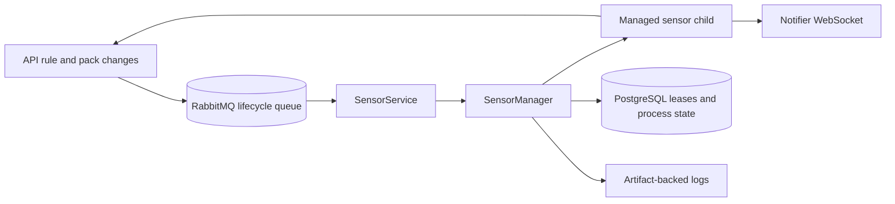

The sensor service is a process supervisor for pack sensors. It starts only needed sensors, assigns each workload to one eligible sensor worker, and keeps the child process supplied with scoped credentials and trigger configuration.

## Responsibilities

`attune-sensor` and `attune-sensor-agent` share the same service core. The service registers a sensor-role worker, heartbeats its capacity and activity, reacts to rule and pack lifecycle changes, acquires sensor workload leases, starts pack sensor entrypoints, rotates child tokens, captures logs, and restarts failed children when active rules still need them.

The managed child creates events through the API using a sensor JWT. The sensor service does not evaluate rules or create enforcements. The executor's event processor owns that next stage.

## Internal mechanisms

[`SensorService`](https://github.com/attune-system/attune/blob/main/crates/sensor/src/service.rs) opens PostgreSQL and RabbitMQ, creates pack and artifact transports, resolves the notifier client URL, and builds `SensorManager` plus `RuleLifecycleListener`. Startup registers the sensor worker before it starts lifecycle processing and heartbeat reporting.

`SensorManager` loads enabled sensors and starts only those with active rules. Before launch it combines pack placement, sensor placement, and placement from every enabled rule that uses the sensor. It rejects incompatible rule constraints and requires the selected worker to satisfy the combined placement. The manager then acquires a fenced, leased workload through repository methods. A competing sensor worker that already owns the workload prevents a duplicate start. A periodic renewal keeps ownership alive. Lifecycle messages are the fast path, while a PostgreSQL reconciliation loop repairs missed changes.

For each child, the manager loads the sensor's runtime and chooses the best locally available version that satisfies its constraint. It creates the pack runtime environment when needed, then launches either the configured interpreter and script or a native executable. The process receives the API URL, scoped API token, sensor and pack identity, workload fence, serialized trigger instances, notifier URL, RabbitMQ details used by sensor SDKs, and artifact directory. See [`sensor_manager.rs`](https://github.com/attune-system/attune/blob/main/crates/sensor/src/sensor_manager.rs).

Children run in their own Unix process groups. Their stdin is closed. Stdout and stderr feed rotating, private artifact versions rather than being copied line by line into service logs. The manager records `sensor_process` state, PID, active-rule count, failure count, and stderr artifact reference.

## Inbound and outbound interfaces

The service itself has no HTTP listener. It consumes rule creation, enable, disable, and deletion events plus pack registration and deletion from `attune.rules.lifecycle.queue`. It reads desired state, placement, leases, runtime definitions, and process history from PostgreSQL. It calls an internal API endpoint to provision sensor tokens and uses pack or artifact API transport when volumes are not shared.

Managed children are the outbound event interface. They post events to the API and may subscribe to `rule_lifecycle_changed` through the notifier so long-running sensor code can refresh trigger instances. The manager writes health and process state to PostgreSQL and emits `core.alert` after repeated child failures.

## PostgreSQL and RabbitMQ

PostgreSQL is authoritative for sensors, triggers, active rules, worker registration, workload leases, runtime versions, process state, process history, and artifact metadata. The lease fence prevents a stale worker from continuing as owner after assignment changes.

RabbitMQ carries lifecycle hints. The durable lifecycle queue uses manual acknowledgements and prefetch 10. The service also calls sensor infrastructure setup, which declares `attune.events.queue` bound to all event traffic, but no service consumes that catch-all queue. A `metadata.trigger.changed` binding is also on the wrong exchange for the API's current publisher. PostgreSQL reconciliation is therefore important, not optional polish. These gaps are tracked in [`internal-message-queues.md`](https://github.com/attune-system/attune/blob/main/docs/architecture/internal-message-queues.md).

## Failure and recovery

An unexpected child exit updates `sensor_process`, captures a bounded stderr excerpt, releases or renews ownership as appropriate, and enters capped exponential backoff from 5 to 300 seconds. After three failures, the manager emits a system alert. It restarts only while active rules still require the sensor. Token rotation happens before expiry and retries with bounded backoff.

Startup or dependency setup can time out. A startup guard kills an incompletely registered child so it cannot escape management. During graceful shutdown the service marks its worker inactive, stops heartbeats, terminates all process groups within the configured timeout, stops the lifecycle consumer, and closes RabbitMQ and PostgreSQL.

## Deployment variants

[`Cargo.toml`](https://github.com/attune-system/attune/blob/main/crates/sensor/Cargo.toml) builds `attune-sensor` and `attune-sensor-agent`. The agent bootstrap auto-detects interpreters and records structured runtime capability data before running the same service. Docker Compose injects `attune-sensor-agent` into a combined Python and Node.js image and defines primary and secondary sensor workers with different placement labels. [`agent_main.rs`](https://github.com/attune-system/attune/blob/main/crates/sensor/src/agent_main.rs) contains the variant entrypoint.

## Caveats

- Sensor children are pack processes owned by the service, not platform service replicas.
- Plain `ws://` notifier URLs are accepted only for loopback or with an explicit insecure opt-in.
- Child event delivery still depends on the API and the child's SDK behavior.
- The unused catch-all RabbitMQ queue can accumulate traffic.
- Rule lifecycle messages accelerate convergence, but PostgreSQL remains the desired-state source.
