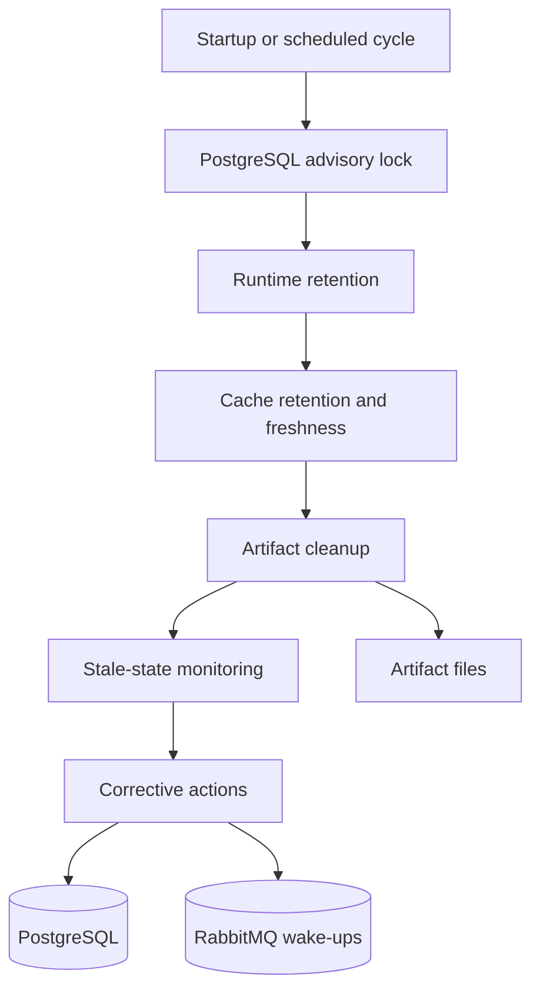

The supervisor is Attune's maintenance process. It runs outside request and dispatch paths, removes expired data, detects stuck state, and applies guarded corrections after normal owners fail to finish their work.

## Responsibilities

`attune-supervisor` owns periodic runtime retention, cache-generation cleanup, time-based artifact cleanup, stale-state alerts, and corrective repair. It is a safety net, not the primary scheduler. The executor still owns normal admission, scheduling, workflow advancement, worker timeout handling, and work-queue dispatch.

The distinction keeps routine work out of broad maintenance scans. Supervisor corrections target records that remained stale beyond configured thresholds or survived a dirty shutdown.

## Internal mechanisms

[`SupervisorService`](https://github.com/attune-system/attune/blob/main/crates/supervisor/src/main.rs) runs a cycle immediately at startup and then sleeps for the interval loaded from PostgreSQL. Each cycle acquires a PostgreSQL advisory lock. If another replica holds it, the process skips the cycle instead of racing. A persisted supervisor-run record distinguishes normal startup from recovery after an unclean prior run.

Runtime retention loads `runtime_retention_config` at the start of every cycle. Hypertable targets such as events and history use chunk removal, while regular tables use bounded row deletion and state-specific eligibility. The loop covers executions, enforcements, inquiries, notifications, queue records, workers, sensor processes, audit data, and related runtime tables. Dry-run mode counts candidates without deleting them.

Cache maintenance runs inside the same lock and cadence. It marks abandoned staging or ready generations failed, deletes failed and expired retired generations in bounded entry batches, drains tombstoned namespaces, and emits freshness or repeated-refresh-failure alerts. It never deletes active generations or retired generations still inside their readable window. The implementation is split into [`cache_retention.rs`](https://github.com/attune-system/attune/blob/main/crates/supervisor/src/cache_retention.rs).

Non-retention maintenance deletes expired time-policy artifact versions and their file bytes. Monitoring counts stuck executions, queue leases, dispatches, and retention lag, then emits deduplicated `core.alert` events. Corrective loops use conditional repository updates so a concurrent owner that already changed a row wins.

## Inbound and outbound interfaces

The supervisor has no public HTTP or queue consumer interface. Its inbound signals are startup, a timer, configuration rows, and current PostgreSQL state. Shared YAML supplies maintenance switches and fallback values; runtime and cache retention settings become database-backed and reload each cycle.

Outbound effects are PostgreSQL deletes, state transitions, audit events, system alert events, artifact-file deletion, and optional RabbitMQ wake-ups. Corrections can republish `ExecutionRequested` for stale requested or newly promoted executions. They can publish `ExecutionCompleted` after terminal repair so workflow and work-queue consumers observe the corrected state.

## PostgreSQL and RabbitMQ

PostgreSQL is required. All selection, retention, alert deduplication, run tracking, and correction goes through `RetentionRepository`, `MaintenanceRepository`, cache repositories, execution repositories, and workflow cache-iteration repositories. The advisory lock scopes the whole cycle, including cache maintenance.

RabbitMQ is optional only when `message_queue` is absent from configuration. In that mode, database cleanup and correction still run, but lifecycle wake-ups do not. If `message_queue` is configured and the broker is unavailable, publisher setup fails and prevents supervisor startup. The supervisor consumes no queues.

## Failure and recovery

A target failure is logged and audited without stopping the remaining retention targets. Cache, artifact, and monitoring phases also isolate bounded failures. The correction phase can end early when a required RabbitMQ publication fails. The next scheduled cycle retries from durable PostgreSQL state.

Conditional updates prevent the supervisor from overwriting a fresh execution transition. Batch sizes cap each scan and deletion pass, so large backlogs drain over multiple cycles rather than monopolizing PostgreSQL. Alert cooldowns and per-cycle limits prevent repeated stale groups from producing unbounded alerts.

On graceful shutdown, the service records a clean stop. If the process dies first, the next startup marks the first cycle as dirty-shutdown recovery. PostgreSQL releases the session advisory lock when its connection ends.

## Deployment variants

[`Cargo.toml`](https://github.com/attune-system/attune/blob/main/crates/supervisor/Cargo.toml) defines the single `attune-supervisor` binary. Docker Compose builds it from the optimized service image, mounts the artifact volume, and uses a process-existence health check. One replica is the intended deployment. Extra replicas are safe standbys because the advisory lock permits one active cycle at a time. Cargo, service-package, and chart deployments run the same loop.

## Caveats

- Retention and correction share one cycle and one advisory lock.
- Runtime retention configuration is database-backed after seeding; most `maintenance` settings are startup-loaded YAML values.
- Omitting RabbitMQ leaves database-only repair available. Losing a configured broker can prevent startup or interrupt the correction phase.
- Artifact cleanup currently constructs a volume transport, so it expects access to the artifact filesystem.
- Cache data is reconstructable snapshot data, not an authoritative business-record store.
