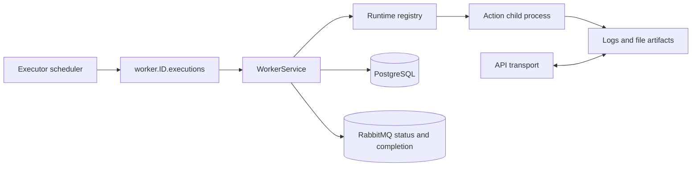

The worker is the action host. It registers local capabilities, consumes work addressed to its database ID, runs pack code, and owns execution state after handoff.

## Responsibilities

`attune-worker` and `attune-agent` share `WorkerService`. The service registers a worker row, reports heartbeats and capabilities, owns per-worker RabbitMQ queues, enforces local concurrency, prepares runtime environments, launches actions, captures output, persists results, and publishes lifecycle messages. It also consumes pack changes, pack-test work, cancellation requests, and metadata invalidations.

Once a targeted dispatch reaches the worker, the worker owns `running`, `completed`, `failed`, `timeout`, and `cancelled` state. The executor remains responsible for workflow and work-queue consequences of the worker's completion message.

## Internal mechanisms

At startup, [`WorkerService`](https://github.com/attune-system/attune/blob/main/crates/worker/src/service.rs) loads runtime definitions from PostgreSQL and builds `ProcessRuntime` instances from non-empty `execution_config` values. Built-in shell, native, and local fallbacks appear only when no executable runtime rows load. Runtime name filtering is alias-aware. A native row has an empty execution config, so it depends on that fallback path rather than creating a separate runtime instance.

The standard worker verifies registered runtime versions and proactively creates pack runtime environments before consuming executions. Pack files come from a shared volume when the API sentinel proves that the mount is shared. Otherwise the worker synchronizes packs through authenticated API transport. Runtime environments live outside pack directories under `runtime_envs_dir`.

The execution consumer obtains a semaphore permit, installs a cancellation token, starts a background task, and then acknowledges the broker delivery. `ActionExecutor` reloads the execution and action, restores encrypted secret parameter values, resolves a compatible runtime version, and builds an execution context. It follows the action's persisted delivery and serialization settings, which support stdin or a temporary file and JSON, YAML, or dotenv. New actions use stdin JSON as the standard contract. Execution metadata and an execution-scoped API token are environment variables; `ATTUNE_API_TOKEN` is present only when the permission snapshot is non-empty. Process handling captures bounded stdout and stderr, applies timeout or cancellation, and promotes logs to private artifacts. See [`executor.rs`](https://github.com/attune-system/attune/blob/main/crates/worker/src/executor.rs) and [`parameter_passing.rs`](https://github.com/attune-system/attune/blob/main/crates/worker/src/runtime/parameter_passing.rs).

## Inbound and outbound interfaces

The worker has no public network listener. RabbitMQ supplies targeted execution dispatch, pack lifecycle, cancellation, and pack-test messages. An ephemeral metadata queue invalidates local action, runtime, and pack caches. PostgreSQL supplies executions, action definitions, runtime versions, keys, and worker state. Pack and artifact bytes use either mounted volumes or authenticated API transport.

Outbound writes update worker heartbeats, capabilities, execution status, results, artifacts, and pack-test records in PostgreSQL. The worker publishes `ExecutionStatusChanged` and `ExecutionCompleted` so the executor can advance dependent work.

## PostgreSQL and RabbitMQ

Registration creates or reactivates the worker and records supported runtimes, placement labels, taints, version availability, and agent metadata. Heartbeats update the same durable worker record. Action, execution, runtime, artifact, and key access goes through repositories.

After registration, the worker declares four durable queues: `worker.{id}.executions`, `.packs`, `.cancel`, and `.packtests`. The execution queue prefetch is `max_concurrent_tasks + 2`; the semaphore blocks acknowledgements until local capacity is available. Once the action task starts, the dispatch is acknowledged before the action finishes. Terminal failures therefore travel as lifecycle messages rather than RabbitMQ nacks.

## Failure and recovery

Worker startup fails if PostgreSQL, RabbitMQ, runtime validation, or required security configuration fails. Pack synchronization and some environment setup errors log and continue, which may defer failure to a specific execution. Artifact storage failures generally do not turn an otherwise successful action into a failed execution.

Cancellation requests are retained in memory when they arrive before the execution token exists. A running Unix process receives SIGTERM and then SIGKILL after its grace period. Graceful shutdown marks the worker inactive first, stops heartbeats, waits up to the configured timeout for action tasks, aborts consumer tasks, and closes broker and database connections. If a process disappears unexpectedly, the executor and supervisor reconcile stale worker and execution rows; an acknowledged dispatch itself is not replayed.

## Deployment variants

[`Cargo.toml`](https://github.com/attune-system/attune/blob/main/crates/worker/Cargo.toml) builds `attune-worker` and `attune-agent`. The standard binary expects an intentional runtime configuration and performs eager setup. The musl-linked agent is injected into an existing runtime image, detects interpreters, can register detected runtime templates, records `agent_mode`, and defers version verification and environment setup until first use. Docker Compose uses `attune-agent` in separate shell, Python, Node.js, and combined runtime containers. [`agent_main.rs`](https://github.com/attune-system/attune/blob/main/crates/worker/src/agent_main.rs) contains that bootstrap difference.

## Caveats

- The agent changes bootstrap and runtime discovery, not execution ownership.
- Action processes are local child processes, not separate Attune services.
- Acknowledgement occurs after task spawn, before action completion.
- Local process execution is isolation by process and runtime environment, not a general security sandbox.
- Shared-volume and API transports must preserve the same pack and artifact semantics.
