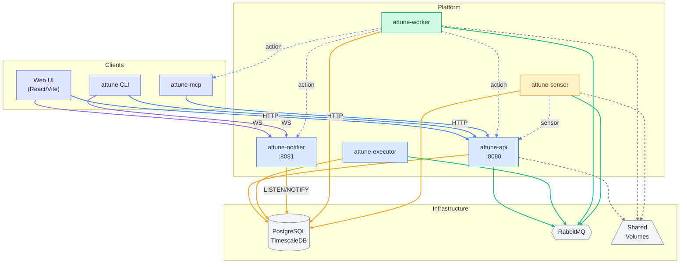
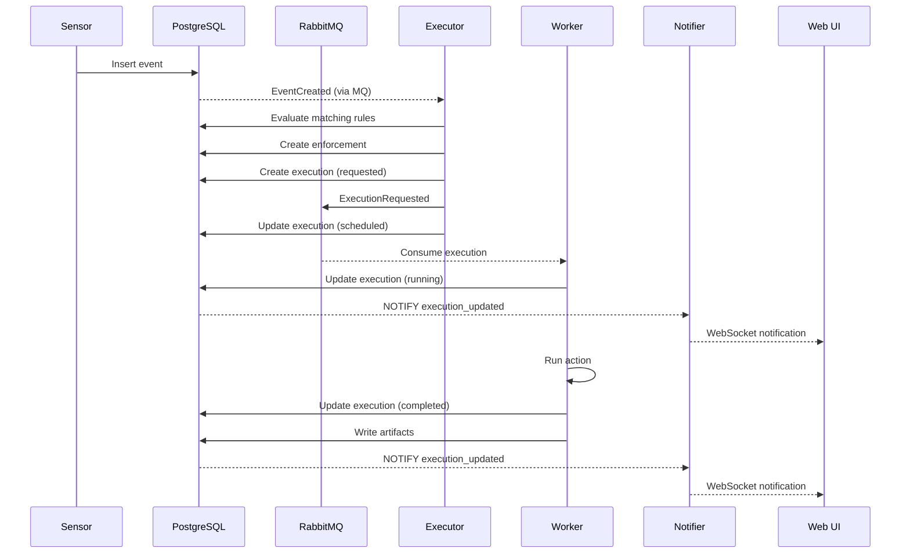
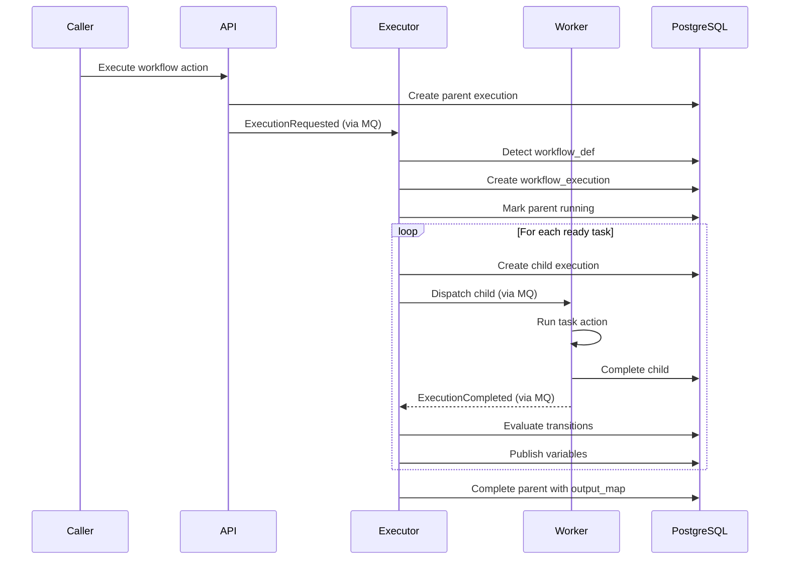
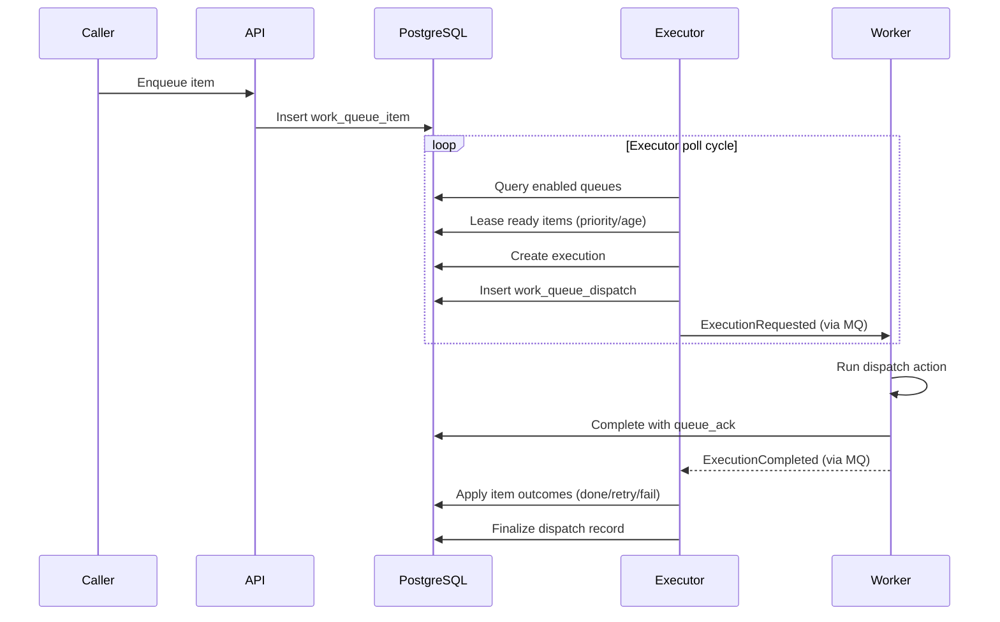

Attune is a distributed service platform built around PostgreSQL/TimescaleDB, RabbitMQ, and independently scalable Rust services.

## Service interaction diagram

> **Legend** &nbsp; 🔵 HTTP &nbsp; 🟣 WebSocket &nbsp; 🟡 SQL &nbsp; 🟢 AMQP &nbsp; ⚫ Filesystem (dashed) &nbsp; Dashed arrows from Worker/Sensor indicate pack action and sensor callbacks to Attune services.

## Services

| Service | Role |
| --- | --- |
| `attune-api` | REST API gateway, authentication, RBAC checks, pack management, and client interactions. |
| `attune-executor` | Execution lifecycle, rule processing, scheduling, policy enforcement, workflow orchestration, and work queue dispatch. |
| `attune-worker` | Executes actions in configured runtimes such as shell, Python, Node.js, or native binaries. |
| `attune-sensor` | Runs sensors and creates events. |
| `attune-notifier` | Streams real-time notifications over authenticated WebSockets using PostgreSQL LISTEN/NOTIFY. |
| Web UI | React/Vite application for users and admins. |
| `attune-mcp` | Optional MCP server exposing curated Attune API tools to agents and harnesses. |

`attune-agent` and `attune-sensor-agent` are not separate platform services. They are statically linked entrypoint binaries copied into arbitrary action-worker or sensor-worker containers. An action-worker container running `attune-agent` registers and behaves as an Attune worker; a sensor-worker container running `attune-sensor-agent` registers and behaves as an Attune sensor worker. This is how Docker Compose and Kubernetes support agent-based workers without building a custom Attune worker image for every runtime.

## Infrastructure

| Component | Use |
| --- | --- |
| PostgreSQL 16+ with TimescaleDB | Primary data store, event and history hypertables, audit data, workflow/queue state, and LISTEN/NOTIFY. |
| RabbitMQ 3.12+ | Asynchronous work dispatch between API, executor, worker, and sensor services. |
| Shared volumes | Pack files, runtime environments, artifacts, agent binaries, and service logs. Optional for workers/sensors - see [Standalone Workers and Sensors](/operations/standalone-workers-and-sensors/). |

## Runtime flow

### Event-triggered action

### Workflow action

### Work queue dispatch

## Data model highlights

- IDs are `BIGINT`/`i64`.
- `event`, `execution_history`, `worker_history`, and `audit_event` are TimescaleDB hypertables; `execution` and `enforcement` remain regular mutable tables.
- Historical execution rows preserve text refs where possible; references to hypertables are plain `BIGINT` rather than foreign keys.
- Entity history is append-only for mutable execution and worker fields.
- Worker cordon metadata records operator intent separately from observed worker status.
- Managed sensor process live state is stored in `sensor_process`; changes are mirrored to `sensor_process_history`.
- Artifacts split metadata from immutable versions; file artifacts are stored on the shared artifact volume.
- Packs own most declarative components and can be system/global or user-created.

## Worker scheduling

The executor filters workers by:

1. Runtime compatibility.
2. Runtime version constraints.
3. Action-level required worker runtimes.
4. Worker labels, selectors, taints/tolerations, affinity, and anti-affinity.
5. Cordon state.
6. Availability and heartbeat health.

Manual executions and workflow tasks can override placement fields. Omitted override fields inherit action defaults; explicit empty objects/arrays clear them.

## Sensor process supervision

Sensor workers run long-lived pack sensor processes. Each process is tracked in `sensor_process` with status, pid, consecutive failures, exit code/signal, timestamps, next restart time, stderr excerpt, and alert bookkeeping.

Managed sensor processes receive rule activate/deactivate lifecycle deltas over authenticated notifier WebSockets rather than direct AMQP subscriptions.

Unexpected exits while enabled rules still reference the sensor are restarted with capped exponential backoff. Repeated failures emit `core.alert` events for routing through normal rules.

Sensor placement uses the same selector/toleration/affinity vocabulary as action placement, but matches sensor-worker labels and taints configured under `sensor.labels` and `sensor.taints`.

## Operational alerts

`core.alert` is a built-in trigger for unexpected Attune component failures. Current emitters include unexpected non-cordoned worker loss, executions abandoned due to worker loss, and repeated managed sensor-process failures.

## Notifications

The notifier subscribes to PostgreSQL channels in a single batch and sends typed WebSocket messages. WebSocket clients authenticate at connection time using either:

- `Authorization: Bearer <jwt>` for non-browser clients.
- Browser subprotocols `attune.v1` and `attune.jwt.<jwt>`.

Tokens in query strings are intentionally not accepted. Mid-connection token expiration closes the socket with code `4401`.

## Deployment shapes

- **Docker Compose** is the standard local and single-host orchestration path.
- **Helm/Kubernetes** supports production-style deployments, hook jobs, and agent workers.
- **Agent workers** allow Attune to run actions inside arbitrary container images without building a custom worker image for every runtime.

## Next

- [Core Concepts](/introduction/core-concepts/)
- [Deployment Overview](/operations/deployment/)
- [Operational Visibility](/operations/visibility/)
- [Monitoring and Troubleshooting](/operations/monitoring/)
