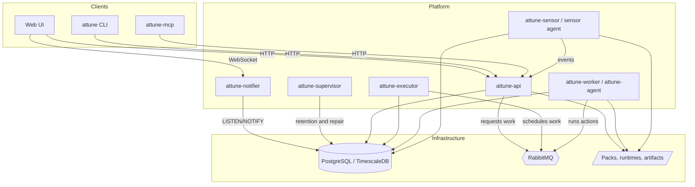

## About

Attune is an event-driven automation and orchestration platform for connecting operational events to reliable, auditable action. It helps teams automate infrastructure, application, and workflow tasks by combining sensors, triggers, rules, actions, workflows, queues, artifacts, and human-in-the-loop inquiries.

Attune is designed for common operational patterns such as:

- **Event-driven remediation** - react to alerts, webhooks, timers, queue items, or custom sensor events; run diagnostics or fixes; and preserve the full execution history for review.
- **Human-guided automation** - pause workflows for approvals or input, assign inquiries to users, and resume execution with the submitted response.
- **Workflow orchestration** - compose actions from one or more packs into branching, retryable, data-driven workflows with typed parameters, secrets, and artifacts.
- **Business work queues** - accept durable work items, lease them to controlled execution batches, retry failures according to queue policy, and keep queue state visible to operators.
- **Execution control** - configure web-managed policies for global, pack, or action scopes to enforce concurrency limits, rate limits, and quotas.
- **Agent-assisted operations** - run CLI, MCP, and execution-scoped API interactions from workers or injected agents without distributing broad credentials.

The core automation content is stored as pack files and YAML definitions, so actions, sensors, rules, workflows, queues, runtimes, and schemas can be reviewed, versioned, shared, and deployed like application code.

## How it Works

Attune connects external systems to internal automation through loosely coupled services. Sensors and API clients create events; the executor evaluates rules and queues work; workers and agents run actions; workflows coordinate multi-step automation; and the API, CLI, web UI, and MCP server expose the platform to users and automation clients.

- **Sensors** watch external systems, timers, files, webhooks, or other inputs and emit Attune events when something meaningful happens.
- **Triggers** define event types. Rules subscribe to triggers and use event payloads to decide what automation should run.
- **Rules** map triggers to actions or workflow actions. They can filter events, render event data into action parameters, and attribute automated work to the owning identity.
- **Actions** are executable units of automation. They may be shell, Python, Node.js, native binaries, or other runtime-backed scripts, and they can be run manually through the API/CLI or automatically through rules, workflows, and queues.
- **Workflows** stitch actions together into larger automations with transitions, retries, delays, `with_items` fan-out, publish variables, inquiries, and type-preserving templates.
- **Work queues** provide durable business queues for automation that should be accepted now and dispatched later under concurrency, batching, coalescing, and retry policies.
- **Policies** control execution throughput with one effective policy per execution: action policies override pack policies, pack policies override global policies, and higher priority wins within the same scope.
- **Packs** are the unit of automation content. A pack groups related actions, sensors, triggers, rules, workflows, queues, runtimes, schemas, and configuration.
- **Data Caches** hold owner-scoped, immutable generations of external business data for deliberate point, multi-ID, and cursor-based reads. They are separate from secrets and execution artifacts.
- **Workers and agents** execute actions. Standard workers run known runtime sets, while the universal Attune agent can be injected into arbitrary containers and auto-detect available runtimes.
- **Artifacts** capture execution outputs such as logs, files, progress updates, URLs, images, and data tables. Retention policies keep artifact storage bounded.
- **Audit and retention services** record security-relevant activity and keep runtime metadata manageable. The supervisor service applies runtime database retention and corrective maintenance so events, executions, audit rows, queue runtime data, workers, and related operational state do not grow forever.

Attune uses PostgreSQL/TimescaleDB for durable runtime state and time-series history, RabbitMQ for asynchronous work dispatch, and WebSocket notifications for real-time UI updates. Services are modular and can be run with Docker Compose, Kubernetes, or Linux packages depending on deployment needs.

## What's Next?

- Install a local system with [Admin Quick Start](/administration/quick-start/), [Docker Operations](/operations/docker/), or [Linux Package Installation](/operations/linux-installation/).
- Learn the building blocks in [What is Attune?](/introduction/what-is-attune/), [Core Concepts](/introduction/core-concepts/), and [Architecture](/introduction/architecture/).
- Create automation content with [Pack Developer Guide](/pack-development/overview/), [Writing Actions](/pack-development/actions/), [Writing Dashboards](/pack-development/dashboards/), [Writing Sensors](/pack-development/sensors/), [Writing and Managing Rules](/pack-development/rules/), and [Writing Workflows](/pack-development/workflows/).
- Operate the platform with [Operational Visibility](/operations/visibility/), [Policy Administration](/administration/policies/), [Data Caches](/administration/data-caches/), [Supervisor Operations](/operations/supervisor/), [Queue Administration](/administration/queues/), and [Monitoring and Troubleshooting](/operations/monitoring/).
- Integrate external tools through the [CLI Reference](/reference/cli/), [API Reference](/reference/api/), and [YAML Reference](/reference/yaml/).

## Maintenance note

This repository is the public manual. The Attune implementation repository
contains deeper engineering documentation and historical work notes. When facts
differ, verify current behavior in the implementation and update this manual.
